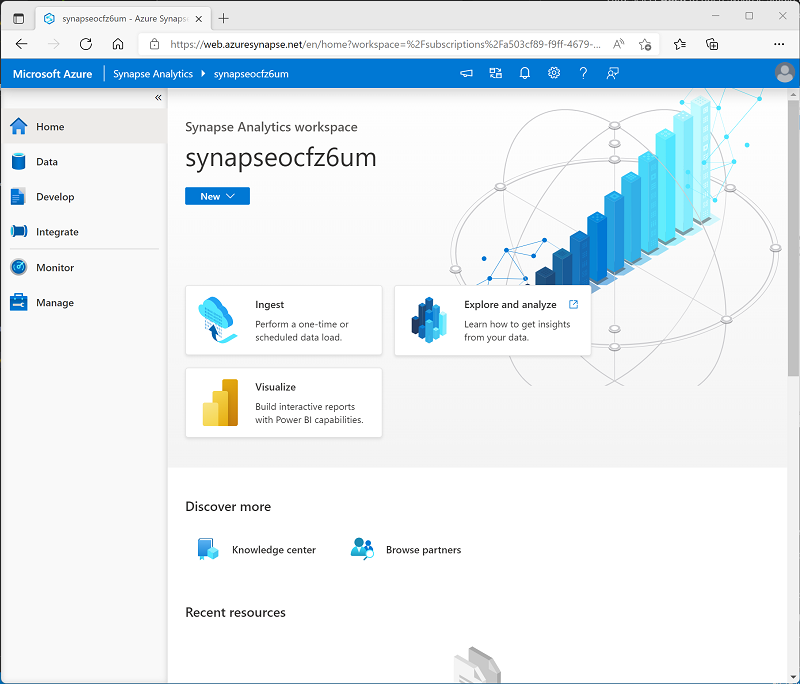

---
lab:
  title: Exploración de Azure Synapse Analytics
  ilt-use: Lab
---

# Exploración de Azure Synapse Analytics

Azure Synapse Analytics proporciona una única plataforma de análisis de datos consolidado para el análisis de datos de un extremo a otro. En este ejercicio, explorarás varias maneras de ingerir y explorar datos. Este ejercicio está diseñado como información general de alto nivel de las distintas funcionalidades principales de Azure Synapse Analytics. Hay otros ejercicios disponibles para explorar funcionalidades específicas con más detalle.

Este ejercicio debería tardar en completarse **60** minutos aproximadamente.

## Antes de empezar

Necesitará una [suscripción de Azure](https://azure.microsoft.com/free) en la que tenga acceso de nivel administrativo.

## Aprovisionar un área de trabajo de Azure Synapse Analytics

Un *área de trabajo* de Azure Synapse Analytics proporciona un punto central para administrar datos y entornos de ejecución de procesamiento de datos. Puedes aprovisionar un área de trabajo mediante la interfaz interactiva en Azure Portal, o bien, puedes implementar un área de trabajo y recursos dentro de él mediante un script o una plantilla. En la mayoría de los escenarios de producción, es mejor automatizar el aprovisionamiento con scripts para poder incorporar la implementación de recursos en un proceso de desarrollo y operaciones repetibles (*DevOps*).

En este ejercicio, usarás una combinación de un script de PowerShell y una plantilla de ARM para aprovisionar Azure Synapse Analytics.

1. En un explorador, inicia sesión en [Azure Portal](https://portal.azure.com) en `https://portal.azure.com`.
2. Usa el botón **[\>_]** a la derecha de la barra de búsqueda en la parte superior de la página para crear un nuevo Cloud Shell en Azure Portal, selecciona un entorno de ***PowerShell*** y crea almacenamiento si se te solicita. Cloud Shell proporciona una interfaz de línea de comandos en un panel situado en la parte inferior de Azure Portal, como se muestra a continuación:

    

    > **Nota**: si creaste anteriormente un Cloud Shell que usa un entorno de *Bash*, usa el menú desplegable situado en la parte superior izquierda del panel de Cloud Shell para cambiarlo a ***PowerShell***.

3. Ten en cuenta que puedes cambiar el tamaño de Cloud Shell arrastrando la barra de separación en la parte superior del panel, o usando los iconos **&#8212;** , **&#9723;** y **X** en la parte superior derecha para minimizar, maximizar y cerrar el panel. Para obtener más información sobre el uso de Azure Cloud Shell, consulta la [documentación de Azure Cloud Shell](https://docs.microsoft.com/azure/cloud-shell/overview).

4. En el panel de PowerShell, esscribe los siguientes comandos para clonar este repositorio:

    ```
    rm -r dp-203 -f
    git clone https://github.com/MicrosoftLearning/dp-203-azure-data-engineer dp-203
    ```

5. Una vez clonado el repositorio, escribe los siguientes comandos para cambiar a la carpeta de este ejercicio y ejecutar el script **setup.ps1** que contiene:

    ```
    cd dp-203/Allfiles/labs/01
    ./setup.ps1
    ```

6. Si se solicita, elige la suscripción que quieres usar (esto solo ocurrirá si tienes acceso a varias suscripciones de Azure).
7. Cuando se te solicite, escribe una contraseña adecuada que se va a establecer para el grupo de SQL de Azure Synapse.

    > **Nota**: asegúrate de recordar esta contraseña. Además, la contraseña no puede contener todo o parte del nombre de inicio de sesión.

8. Espera a que se complete el script; normalmente tarda unos 20 minutos, pero en algunos casos puede tardar más tiempo. Mientras esperas, revise el artículo [¿Qué es Azure Synapse Analytics?](https://docs.microsoft.com/azure/synapse-analytics/overview-what-is) en la documentación de Azure Synapse Analytics.

## Exploración de Azure Synapse Studio

*Synapse Studio* es un portal basado en web en el que puedes administrar y trabajar con los recursos del área de trabajo de Azure Synapse Analytics.

1. Cuando el script de instalación ha terminado de ejecutarse, en Azure Portal, verás el grupo de recursos **dp203-*xxxxxxx*** que se creó y observarás que este grupo de recursos contiene el área de trabajo de Synapse, una cuenta de almacenamiento para el lago de datos, un grupo de Apache Spark y un grupo de SQL dedicado.
2. Selecciona tu área de trabajo de Synapse y, en tu página **Información general**, en la tarjeta **Abrir Synapse Studio**, selecciona **Abrir** para abrir Synapse Studio en una nueva pestaña del explorador. Synapse Studio es una interfaz web que puedes usar para trabajar con tu área de trabajo de Synapse Analytics.
3. En el lado izquierdo de Synapse Studio, use el icono **&rsaquo;&rsaquo;** para expandir el menú; esto muestra las distintas páginas de Synapse Studio que usará para administrar recursos y realizar tareas de análisis de datos, como se muestra aquí:

    

4. Visualiza la página **Datos** y ten en cuenta que hay dos pestañas que contienen orígenes de datos:
    - Una pestaña **Área de trabajo** que contiene las bases de datos definidas en el área de trabajo (incluidas las bases de datos SQL dedicadas y las bases de datos del Explorador de datos)
    - Una pestaña **Vinculado** que contiene orígenes de datos vinculados al área de trabajo, incluido Azure Data Lake Storage.

5. Visualiza la página **Desarrollar**, que está vacía actualmente. Aquí es donde puedes definir scripts y otros recursos usados para desarrollar soluciones de procesamiento de datos.
6. Visualiza la página **Integrar**, que también está vacía. Esta página se usa para administrar los recursos de integración y ingesta de datos; por ejemplo, las canalizaciones para transferir y transformar datos entre orígenes de datos.
7. Visualiza la página **Supervisión**. Aquí es donde puedes observar los trabajos de procesamiento de datos mientras se ejecutan y ver su historial.
8. Visualiza la página **Administrar**. Aquí es donde se administran los grupos, los entornos de ejecución y otros recursos usados en el área de trabajo de Azure Synapse. Visualiza cada una de las pestañas de la sección **Grupos de análisis** y ten en cuenta que el área de trabajo incluye los grupos siguientes:
    - **Grupos de SQL**.
        - **Integrado**: un grupo de SQL *sin servidor* que puede usar a petición para explorar o procesar datos en un lago de datos mediante comandos SQL.
        - **sql*xxxxxxx***: un grupo de SQL *dedicado* que hospeda una base de datos de almacenamiento de datos relacional.
    - **Grupos de Apache Spark**:
        - **spark*xxxxxxx***: que puedes usar a petición para explorar o procesar datos en un lago de datos con lenguajes de programación como Scala o Python.

## Ingesta de datos con una canalización

Una de las tareas clave que puede realizar con Azure Synapse Analytics es definir *canalizaciones* que transfieran (y, si es necesario, transformen) datos de una amplia variedad de orígenes al área de trabajo para su análisis.

### Usar la tarea Copiar datos para crear una canalización

1. En la página **Inicio** de Synapse Studio, seleccione **Ingerir** para abrir la herramienta **Copiar datos**.
2. En la herramienta Copiar datos, en el paso **Propiedades**, asegúrese de que las opciones **Built-in copy task** (Tarea de copia integrada) y **Run once now** (Ejecutar una vez ahora) están seleccionadas y haga clic en **Siguiente >**.
3. En el paso **Origen**, en el subpaso **Conjunto de datos**, seleccione la siguiente configuración:
    - **Tipo de origen**: todos
    - **Conexión**: *crea una nueva conexión y, en el panel **Servicio vinculado** que aparece, en la pestaña **Protocolo genérico**, selecciona **HTTP**. Después, continúa y crea una conexión a un archivo de datos con la siguiente configuración:*
        - **Nombre**: Productos
        - **Descripción**: lista de productos a través de HTTP
        - **Conectar mediante Integration Runtime**: AutoResolveIntegrationRuntime
        - **Dirección URL base**: `https://raw.githubusercontent.com/MicrosoftLearning/dp-203-azure-data-engineer/master/Allfiles/labs/01/adventureworks/products.csv`
        - **Validación del certificado de servidor**: habilitar
        - **Tipo de autenticación**: anónimo
4. Después de crear la conexión, en la página **Almacén de datos de origen**, asegúrate de que están seleccionadas las siguientes opciones de configuración y después selecciona **Siguiente >**:
    - **Dirección URL relativa**: *dejar en blanco*
    - **Request method** (Método de solicitud): GET
    - **Encabezados adicionales**: *dejar en blanco*
    - **Copia binaria**: <u>sin</u> seleccionar
    - **Tiempo de espera de solicitud**: *dejar en blanco*
    - **Número máximo de conexiones simultáneas**: *dejar en blanco*
5. En el paso **Origen**, en el subpaso **Configuración**, seleccione **Vista previa de los datos** para obtener una vista previa de los datos del producto que la canalización va a ingerir y, a continuación, cierre la vista previa.
6. Después de previsualizar los datos, en la página **Configuración del formato de archivo**, asegúrate de que están seleccionadas las siguientes opciones de configuración y luego selecciona **Siguiente >**:
    - **Formato de archivo**: DelimitedText
    - **Delimitador de columna**: coma (,)
    - **Delimitador de fila**: avance de línea (\n)
    - **Primera fila como encabezado**: seleccionada
    - **Tipo de compresión**: ninguno
7. En el paso **Destino**, en el subpaso **Conjunto de datos**, seleccione la siguiente configuración:
    - **Tipo de destino**: Azure Data Lake Storage Gen 2.
    - **Conexión**: *seleccione la conexión existente a su instancia de Data Lake Store (se creó automáticamente al crear el área de trabajo).*
8. Después de seleccionar la conexión, en el paso **Destino/Conjunto de datos**, asegúrese de que está seleccionada la siguiente configuración y, después, elija **Siguiente >** :
    - **Ruta de acceso a la carpeta**: files/product_data
    - **Nombre de archivo**: products.csv
    - **Comportamiento de copia**: ninguno
    - **Número máximo de conexiones simultáneas**: *dejar en blanco*
    - **Tamaño de bloque (MB)**: *dejar en blanco*
9. En el paso **Destino**, en el subpaso **Configuración**, en la página **Configuración del formato del archivo**, asegúrate de que están seleccionadas las siguientes propiedades. Luego, seleccione **Siguiente >**.
    - **Formato de archivo**: DelimitedText
    - **Delimitador de columna**: coma (,)
    - **Delimitador de fila**: avance de línea (\n)
    - **Agregar encabezado al archivo**: seleccionado
    - **Tipo de compresión**: ninguno
    - **Número máximo de filas por archivo**: *dejar en blanco*
    - **Prefijo de nombre de archivo**: *dejar en blanco*
10. En el paso **Configuración**, configure las opciones siguientes y, a continuación, haga clic en **Siguiente >**:
    - **Nombre de tarea**: copiar productos
    - **Descripción de la tarea**: copia de datos de productos
    - **Tolerancia a errores**: *dejar en blanco*
    - **Habilitar registro**: <u>sin</u> seleccionar
    - **Habilitar almacenamiento provisional**: <u>sin</u> seleccionar
11. En el paso **Revisar y finalizar**, en el subpaso **Revisar**, lea el resumen y, a continuación, haga clic en **Siguiente >**.
12. En el paso **Implementación**, espere a que se implemente la canalización y, a continuación, haga clic en **Finalizar**.
13. En Synapse Studio, seleccione la página **Supervisar** y, en la pestaña **Ejecuciones de canalizaciones**, espere a que la canalización **Copy products** se complete con el estado **Correcto** (puede usar el botón **&#8635; Actualizar** de la página Ejecuciones de canalizaciones para actualizar el estado).
14. Visualiza la página **Integrar** y comprueba que ahora contiene una canalización denominada **Copiar productos**.

### Visualización de la cantidad de datos ingeridos

1. En la página **Datos**, selecciona la pestaña **Vinculado** y expande la jerarquía de contenedores **synapse*xxxxxxx* (Primary) datalake** hasta que veas el almacenamiento de archivos **archivos** para el área de trabajo de Synapse. A continuación, selecciona el almacenamiento de archivos para comprobar que una carpeta llamada **product_data** que contiene un archivo llamado **products.csv** se ha copiado en esta ubicación, como se muestra aquí:

    

2. Haz clic con el botón derecho en el archivo de datos **products.csv** y selecciona **Vista previa** para ver los datos ingeridos. Luego cierra la vista previa.

## Uso de un grupo de SQL sin servidor para analizar datos

Ahora que ha ingerido algunos datos en el área de trabajo, puede usar Synapse Analytics para consultarlos y analizarlos. Una de las formas más comunes de consultar datos es usar SQL y, en Synapse Analytics, puedes usar un grupo de SQL para ejecutar código SQL con datos en un lago de datos.

1. En Synapse Studio, haga clic con el botón derecho en el archivo **products.csv** del almacenamiento de archivos del área de trabajo de Synapse, seleccione **New SQL script** (Nuevo script SQL) y seleccione **Seleccionar las primeras 100 filas**.
2. En el panel **SQL Script 1** (Script SQL 1) que se abre, revise el código SQL que se ha generado, que debe ser similar al siguiente:

    ```SQL
    -- This is auto-generated code
    SELECT
        TOP 100 *
    FROM
        OPENROWSET(
            BULK 'https://datalakexxxxxxx.dfs.core.windows.net/files/product_data/products.csv',
            FORMAT = 'CSV',
            PARSER_VERSION='2.0'
        ) AS [result]
    ```

    Este código abre un conjunto de filas del archivo de texto que importó y recupera las primeras 100 filas de datos.

3. En la lista **Conectar a**, asegúrese de que **Integrado** está seleccionado: representa el grupo de SQL integrado que se creó con el área de trabajo.
4. En la barra de herramientas, use el botón **&#9655; Ejecutar** para ejecutar el código SQL y revise los resultados, que deben tener un aspecto similar al siguiente:

    | C1 | C2 | C3 | C4 |
    | -- | -- | -- | -- |
    | ProductID | ProductName | Category | ListPrice |
    | 771 | Mountain-100 Silver, 38 | Bicicletas de montaña | 3399.9900 |
    | 772 | Mountain-100 Silver, 42 | Bicicletas de montaña | 3399.9900 |
    | ... | ... | ... | ... |

5. Tenga en cuenta que los resultados constan de cuatro columnas denominadas C1, C2, C3 y C4, y que la primera fila de los resultados contiene los nombres de los campos de datos. Para corregir este problema, agrega un parámetro HEADER_ROW = TRUE a la función OPENROWSET tal como se muestra aquí (reemplazando *datalakexxxxxxx* por los nombres de la cuenta de almacenamiento del lago de datos y el sistema de archivos), y luego vuelve a ejecutar la consulta:

    ```SQL
    SELECT
        TOP 100 *
    FROM
        OPENROWSET(
            BULK 'https://datalakexxxxxxx.dfs.core.windows.net/files/product_data/products.csv',
            FORMAT = 'CSV',
            PARSER_VERSION='2.0',
            HEADER_ROW = TRUE
        ) AS [result]
    ```

    Ahora los resultados son similares a los siguientes:

    | ProductID | ProductName | Category | ListPrice |
    | -- | -- | -- | -- |
    | 771 | Mountain-100 Silver, 38 | Bicicletas de montaña | 3399.9900 |
    | 772 | Mountain-100 Silver, 42 | Bicicletas de montaña | 3399.9900 |
    | ... | ... | ... | ... |

6. Modifica la consulta como se muestra a continuación (reemplazando *datalakexxxxxxx* por el nombre de tu cuenta de Data Lake Storage):

    ```SQL
    SELECT
        Category, COUNT(*) AS ProductCount
    FROM
        OPENROWSET(
            BULK 'https://datalakexxxxxxx.dfs.core.windows.net/files/product_data/products.csv',
            FORMAT = 'CSV',
            PARSER_VERSION='2.0',
            HEADER_ROW = TRUE
        ) AS [result]
    GROUP BY Category;
    ```

7. Ejecute la consulta modificada, que debe devolver un conjunto de resultados que contenga el número de productos de cada categoría, de la siguiente forma:

    | Category | ProductCount |
    | -- | -- |
    | Culotes | 3 |
    | Bastidores de bicicletas | 1 |
    | ... | ... |

8. En el panel **Propiedades** de **SQL Script 1** (Script SQL 1), cambie el **Nombre** a **Count Products by Category** (Contar productos por categoría). A continuación, en la barra de herramientas, seleccione **Publicar** para guardar el script.

9. Cierre el panel de scripts **Count Products by Category** (Contar productos por categoría).

10. En Synapse Studio, seleccione la página **Desarrollar** y observe que el script SQL publicado **Count Products by Category** (Contar productos por categoría) se ha guardado allí.

11. Seleccione el script SQL **Count Products by Category** (Contar productos por categoría) para volver a abrirlo. A continuación, asegúrese de que el script está conectado al grupo de SQL **Integrado** y ejecútelo para obtener el recuento de productos.

12. En el panel **Resultados**, seleccione la vista **Gráfico** y, a continuación, seleccione la siguiente configuración para el gráfico:
    - **Tipo de gráfico**: columna
    - **Columna de categoría**: categoría
    - **Columnas de leyenda (serie)**: ProductCount
    - **Posición de la leyenda**: inferior central
    - **Etiqueta de leyenda (serie)**: *dejar en blanco*
    - **Valor mínimo de leyenda (serie)**: *dejar en blanco*
    - **Valor máximo de leyenda (serie)**: *dejar en blanco*
    - **Etiqueta de categoría**: *dejar en blanco*

    El gráfico resultante debe ser similar al siguiente:

    

## Usar un grupo de Spark para analizar datos

Aunque SQL es un lenguaje común para consultar conjuntos de datos estructurados, muchos analistas de datos consideran que lenguajes como Python son útiles para explorar y preparar los datos para su análisis. En Azure Synapse Analytics, puede ejecutar código de Python (y otro) en un *Grupo de Spark*, que usa un motor de procesamiento de datos distribuido basado en Apache Spark.

1. En Synapse Studio, si la pestaña **archivos** que abriste antes y que contiene el archivo **products.csv** ya no está abierta, en la página **Datos**, busca la carpeta **product_data**. A continuación, haga clic con el botón derecho en **products.csv**, seleccione **Nuevo cuaderno** y seleccione **Cargar en DataFrame**.
2. En el panel **Cuaderno 1** que se abre, en la lista **Asociar a**, selecciona el grupo **sparkxxxxxxx** de Spark y asegúrate de que el **Lenguaje** está configurado como **PySpark (Python)**.
3. Revise solo el código de la primera celda del cuaderno, que debe tener este aspecto:

    ```Python
    %%pyspark
    df = spark.read.load('abfss://files@datalakexxxxxxx.dfs.core.windows.net/product_data/products.csv', format='csv'
    ## If header exists uncomment line below
    ##, header=True
    )
    display(df.limit(10))
    ```

4. Use el icono **&#9655;** situado a la izquierda de la celda de código para ejecutarlo y espere a obtener los resultados. La primera vez que ejecuta una celda en un cuaderno, se inicia el grupo de Spark, por lo que puede tardar más o menos un minuto en devolver los resultados.
5. Finalmente, los resultados deben aparecer debajo de la celda y deben ser similares a estos:

    | _c0_ | _c1_ | _c2_ | _c3_ |
    | -- | -- | -- | -- |
    | ProductID | ProductName | Category | ListPrice |
    | 771 | Mountain-100 Silver, 38 | Bicicletas de montaña | 3399.9900 |
    | 772 | Mountain-100 Silver, 42 | Bicicletas de montaña | 3399.9900 |
    | ... | ... | ... | ... |

6. Quite la marca de comentario de la línea *,header=True* (porque el archivo products.csv tiene los encabezados de columna en la primera línea), por lo que el código tiene el siguiente aspecto:

    ```Python
    %%pyspark
    df = spark.read.load('abfss://files@datalakexxxxxxx.dfs.core.windows.net/product_data/products.csv', format='csv'
    ## If header exists uncomment line below
    , header=True
    )
    display(df.limit(10))
    ```

7. Vuelva a ejecutar la celda y compruebe que los resultados son similares a los siguientes:

    | ProductID | ProductName | Category | ListPrice |
    | -- | -- | -- | -- |
    | 771 | Mountain-100 Silver, 38 | Bicicletas de montaña | 3399.9900 |
    | 772 | Mountain-100 Silver, 42 | Bicicletas de montaña | 3399.9900 |
    | ... | ... | ... | ... |

    Tenga en cuenta que volver a ejecutar la celda tarda menos tiempo, porque el grupo de Spark ya se ha iniciado.

8. En los resultados, use el icono **&#65291; Código** para agregar una nueva celda de código al cuaderno.
9. En la nueva celda de código vacía, agregue el código siguiente:

    ```Python
    df_counts = df.groupby(df.Category).count()
    display(df_counts)
    ```

10. Ejecute la nueva celda de código haciendo clic en su icono **&#9655;** y revise los resultados, que deben tener un aspecto similar al siguiente:

    | Category | count |
    | -- | -- |
    | Tubos de dirección | 3 |
    | Ruedas | 14 |
    | ... | ... |

11. En la salida de resultados de la celda, seleccione la vista **Gráfico**. El gráfico resultante debe ser similar al siguiente:

    

12. Si aún no está visible, muestra la página **Propiedades** seleccionando el botón **Propiedades** (que tiene un aspecto similar a **<sub>*</sub>**) en el extremo derecho de la barra de herramientas. Después, en el panel **Propiedades**, cambia el nombre del cuaderno por **Explorar productos** y usa el botón **Publicar** de la barra de herramientas para guardarlo.

13. Cierra el panel del cuaderno y detén la sesión de Spark cuando se te solicite. Después, consulta la página **Desarrollar** para comprobar que el cuaderno se ha guardado.

## Usar un grupo SQL dedicado para consultar un almacenamiento de datos

Hasta ahora has visto algunas técnicas para explorar y procesar datos basados en archivos en un lago de datos. En muchos casos, una solución de análisis empresarial usa un lago de datos para almacenar y preparar datos no estructurados que luego pueden cargarse en un almacenamiento de datos relacional para admitir las cargas de trabajo de la inteligencia empresarial (BI). En Azure Synapse Analytics, estos almacenamientos de datos pueden implementarse en un grupo de SQL dedicado.

1. En Synapse Studio, en la página **Administrar**, en la sección **Grupos de SQL**, selecciona la fila **sql*xxxxxxx*** del grupo de SQL dedicado y después usa su icono **▷** para reanudarlo.
2. Espera a que se inicie el grupo de SQL. Esta operación puede tardar unos minutos. Usa el botón **↻ Actualizar** para comprobar su estado periódicamente. El estado se mostrará como **En línea** cuando esté listo.
3. Cuando se haya iniciado el grupo de SQL, selecciona la página **Datos**. En la pestaña **Área de trabajo**, expande **Bases de datos de SQL** y comprueba que **sql*xxxxxxx*** aparece en la lista (usa el icono **↻** de la parte superior izquierda de la página para actualizar la vista si es necesario).
4. Expande la base de datos **sql*xxxxxxx*** y su carpeta **Tables** y después, en el menú **...** de la tabla **FactInternetSales**, apunta a **Nuevo script SQL** y selecciona **Seleccionar las 100 primeras filas**.
5. Revisa los resultados de la consulta, que muestran las 100 primeras transacciones de ventas de la tabla. Estos datos se han cargado en la base de datos con el script de configuración y se almacenan de forma permanente en la base de datos asociada al grupo de SQL dedicado.
6. Reemplaza la consulta de SQL por el siguiente código:

    ```sql
    SELECT d.CalendarYear, d.MonthNumberOfYear, d.EnglishMonthName,
           p.EnglishProductName AS Product, SUM(o.OrderQuantity) AS UnitsSold
    FROM dbo.FactInternetSales AS o
    JOIN dbo.DimDate AS d ON o.OrderDateKey = d.DateKey
    JOIN dbo.DimProduct AS p ON o.ProductKey = p.ProductKey
    GROUP BY d.CalendarYear, d.MonthNumberOfYear, d.EnglishMonthName, p.EnglishProductName
    ORDER BY d.MonthNumberOfYear
    ```

7. Usa el botón **▷ Ejecutar** para ejecutar la consulta modificada, que devuelve la cantidad de cada producto vendido por año y mes.
8. Si aún no está visible, muestra la página **Propiedades** seleccionando el botón **Propiedades** (que tiene un aspecto similar a **<sub>*</sub>**) en el extremo derecho de la barra de herramientas. Después, en el panel **Propiedades**, cambia el nombre de la consulta por **Agregar ventas de productos** y usa el botón **Publicar** de la barra de herramientas para guardarla.

9. Cierra el panel de consulta y después consulta la página **Desarrollar** para comprobar que se ha guardado el script SQL.

10. En la página **Administrar**, selecciona la fila **sql*xxxxxxx*** dedicada al grupo deSQL y usa su icono ❚❚ para pausarla.

<!--- ## Explore data with a Data Explorer pool

Azure Synapse Data Explorer provides a runtime that you can use to store and query data by using Kusto Query Language (KQL). Kusto is optimized for data that includes a time series component, such as realtime data from log files or IoT devices.

### Create a Data Explorer database and ingest data into a table

1. In Synapse Studio, on the **Manage** page, in the **Data Explorer pools** section, select the **adx*xxxxxxx*** pool row and then use its **&#9655;** icon to resume it.
2. Wait for the pool to start. It can take some time. Use the **&#8635; Refresh** button to check its status periodically. The status will show as **online** when it is ready.
3. When the Data Explorer pool has started, view the **Data** page; and on the **Workspace** tab, expand **Data Explorer Databases** and verify that **adx*xxxxxxx*** is listed (use **&#8635;** icon at the top-left of the page to refresh the view if necessary)
4. In the **Data** pane, use the **&#65291;** icon to create a new **Data Explorer database** in the **adx*xxxxxxx*** pool with the name **sales-data**.
5. In Synapse Studio, wait for the database to be created (a notification will be displayed).
6. Switch to the **Develop** page, and in the **+** menu, add a KQL script. Then, when the script pane opens, in the **Connect to** list, select your **adx*xxxxxxx*** pool, and in the **Database** list, select **sales-data**.
7. In the new script, add the following code:

    ```kusto
    .create table sales (
        SalesOrderNumber: string,
        SalesOrderLineItem: int,
        OrderDate: datetime,
        CustomerName: string,
        EmailAddress: string,
        Item: string,
        Quantity: int,
        UnitPrice: real,
        TaxAmount: real)
    ```

8. On the toolbar, use the **&#9655; Run** button to run the selected code, which creates a table named **sales** in the **sales-data** database you created previously.
9. After the code has run successfully, replace it with the following code, which loads data into the table:

    ```kusto
    .ingest into table sales 'https://raw.githubusercontent.com/microsoftlearning/dp-203-azure-data-engineer/master/Allfiles/labs/01/files/sales.csv' 
    with (ignoreFirstRecord = true)
    ```

10. Run the new code to ingest the data.

> **Note**: In this example, you imported a very small amount of batch data from a file, which is fine for the purposes of this exercise. In reality, you can use Data Explorer to analyze much larger volumes of data; including realtime data from a streaming source such as Azure Event Hubs.

### Use Kusto query language to query the table

1. Switch back to the **Data** page and in the **...** menu for the **sales-data** database, select **Refresh**.
2. Expand the **sales-data** database's **Tables** folder. Then in the **...** menu for the **sales** table, select **New KQL script** > **Take 1000 rows**.
3. Review the generated query and its results. The query should contain the following code:

    ```kusto
    sales
    | take 1000
    ```

    The results of the query contain the first 1000 rows of data.

4. Modify the query as follows:

    ```kusto
    sales
    | where Item == 'Road-250 Black, 48'
    ```

5. Use the **&#9655; Run** button to run the query. Then review the results, which should contain only the rows for sales orders for the *Road-250 Black, 48* product.

6. Modify the query as follows:

    ```kusto
    sales
    | where Item == 'Road-250 Black, 48'
    | where datetime_part('year', OrderDate) > 2020
    ```

7. Run the query and review the results, which should contain only sales orders for *Road-250 Black, 48* made after 2020.

8. Modify the query as follows:

    ```kusto
    sales
    | where OrderDate between (datetime(2020-01-01 00:00:00) .. datetime(2020-12-31 23:59:59))
    | summarize TotalNetRevenue = sum(UnitPrice) by Item
    | sort by Item asc
    ```

9. Run the query and review the results, which should contain the total net revenue for each product between January 1st and December 31st 2020 in ascending order of product name.

10. If it is not already visible, show the **Properties** page by selecting the **Properties** button (which looks similar to **&#128463;<sub>*</sub>**) on the right end of the toolbar. Then in the **Properties** pane, change the query name to **Explore sales data** and use the **Publish** button on the toolbar to save it.

11. Close the query pane, and then view the **Develop** page to verify that the KQL script has been saved.

12. On the **Manage** page, select the **adx*xxxxxxx*** Data Explorer pool row and use its &#10074;&#10074; icon to pause it. --->

## Eliminación de recursos de Azure

Ahora que ha terminado de explorar Azure Synapse Analytics, debe eliminar los recursos que ha creado para evitar costos innecesarios de Azure.

1. Cierre la pestaña del explorador de Synapse Studio y vuelva a Azure Portal.
2. En Azure Portal, en la página **Inicio**, seleccione **Grupos de recursos**.
3. Selecciona el grupo de recursos **dp203-*xxxxxxx*** para tu área de trabajo de Synapse Analytics (no el grupo de recursos administrados) y comprueba que contiene el área de trabajo de Synapse, la cuenta de almacenamiento, el grupo de SQL y el grupo de Spark para tu área de trabajo.
4. En la parte superior de la página **Información general** del grupo de recursos, seleccione **Eliminar grupo de recursos**.
5. Especifica el nombre del grupo de recursos **dp203-*xxxxxxx*** para confirmar que quieres eliminarlo y selecciona **Eliminar**.

    Después de unos minutos, se eliminarán el grupo de recursos de área de trabajo de Azure Synapse y el grupo de recursos de área de trabajo administrado asociado a él.
