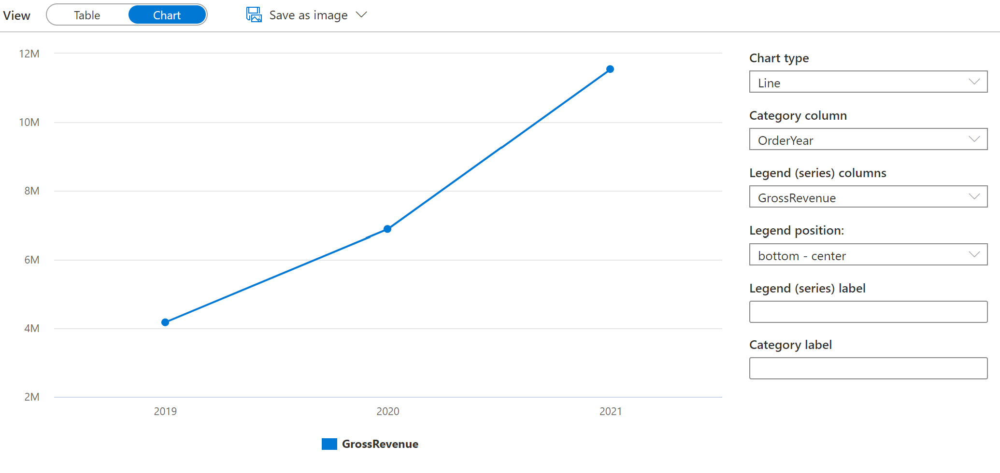

---
lab:
  title: Consulta de archivos mediante un grupo de SQL sin servidor
  ilt-use: Lab
---

# Consulta de archivos mediante un grupo de SQL sin servidor

SQL es probablemente el lenguaje más usado para trabajar con datos en el mundo. La mayoría de los analistas de datos son expertos en el uso de consultas SQL para recuperar, filtrar y agregar datos, normalmente en bases de datos relacionales. A medida que las organizaciones aprovechan cada vez más el almacenamiento de archivos escalable para crear lagos de datos, SQL suele seguir siendo la opción preferida para consultar los datos. Azure Synapse Analytics proporciona grupos de SQL sin servidor que permiten desacoplar el motor de consultas SQL del almacenamiento de datos y ejecutar consultas en archivos de datos en formatos de archivo comunes, como texto delimitado y Parquet.

Se tardan aproximadamente **40** minutos en completar este laboratorio.

## Antes de empezar

Necesitará una [suscripción de Azure](https://azure.microsoft.com/free) en la que tenga acceso de nivel administrativo.

## Aprovisionar un área de trabajo de Azure Synapse Analytics

Necesitarás un área de trabajo de Azure Synapse Analytics con acceso a Data Lake Storage. Puedes usar el grupo de SQL sin servidor integrado para consultar archivos en el lago de datos.

En este ejercicio usarás una combinación de un script de PowerShell y una plantilla de ARM para aprovisionar un área de trabajo de Azure Synapse Analytics.

1. Inicie sesión en [Azure Portal](https://portal.azure.com) en `https://portal.azure.com`.
2. Usa el botón **[\>_]** situado a la derecha de la barra de búsqueda en la parte superior de la página para crear una nueva instancia de Cloud Shell en Azure Portal, para lo que deberás seleccionar un entorno de ***PowerShell*** y crear almacenamiento si se solicita. Cloud Shell proporciona una interfaz de línea de comandos en un panel situado en la parte inferior de Azure Portal, como se muestra a continuación:

    

    > **Nota**: si creaste anteriormente un Cloud Shell que usa un entorno de *Bash*, usa el menú desplegable situado en la parte superior izquierda del panel de Cloud Shell para cambiarlo a ***PowerShell***.

3. Ten en cuenta que puedes cambiar el tamaño de Cloud Shell arrastrando la barra de separación en la parte superior del panel, o usando los iconos **&#8212;** , **&#9723;** y **X** en la parte superior derecha para minimizar, maximizar y cerrar el panel. Para obtener más información sobre el uso de Azure Cloud Shell, consulta la [documentación de Azure Cloud Shell](https://docs.microsoft.com/azure/cloud-shell/overview).

4. En el panel de PowerShell, escribe los siguientes comandos para clonar este repositorio:

    ```
    rm -r dp203 -f
    git clone https://github.com/MicrosoftLearning/dp-203-azure-data-engineer dp203
    ```

5. Una vez clonado el repositorio, escribe los siguientes comandos para cambiar a la carpeta de este laboratorio y ejecuta el script **setup.ps1** que contiene:

    ```
    cd dp203/Allfiles/labs/02
    ./setup.ps1
    ```

6. Si se te solicita, elige la suscripción que deseas usar (esto solo ocurrirá si tienes acceso a varias suscripciones de Azure).
7. Cuando se te solicite, escribe una contraseña adecuada que se va a establecer para el grupo de SQL de Azure Synapse.

    > **Nota**: Asegúrate de recordar esta contraseña.

8. Espera a que se complete el script: normalmente tarda unos 10 minutos, pero en algunos casos puede tardar más. Mientras esperas, revisa el artículo [Grupo de SQL sin servidor en Azure Synapse Analytics](https://docs.microsoft.com/azure/synapse-analytics/sql/on-demand-workspace-overview) en la documentación de Azure Synapse Analytics.

## Consulta de datos en archivos

El script aprovisiona un área de trabajo de Azure Synapse Analytics y una cuenta de Azure Storage para hospedar el lago de datos y luego carga algunos archivos de datos en el lago de datos.

### Visualización de archivos en el lago de datos

1. Una vez completado el script, en Azure Portal, ve al grupo de recursos **dp203-*xxxxxxx*** que creó y selecciona el área de trabajo de Synapse.
2. En la página **Información general** de tu área de trabajo de Synapse, en la tarjeta **Abrir Synapse Studio**, selecciona **Abrir** para abrir Synapse Studio en una nueva pestaña del explorador e inicia sesión si se te solicita.
3. En el lado izquierdo de Synapse Studio, usa el icono **&rsaquo;&rsaquo;** para expandir el menú. Esta acción mostrará las diferentes páginas de Synapse Studio que usarás para administrar recursos y realizar tareas de análisis de datos.
4. En la página **Datos**, consulta la pestaña **Vinculado** y comprueba que el área de trabajo incluye un vínculo a la cuenta de almacenamiento de Azure Data Lake Storage Gen2, que debe tener un nombre similar a **synapse*xxxxxxx* (Primary - datalake*xxxxxxx*)**.
5. Expande tu cuenta de almacenamiento y comprueba que contiene un contenedor del sistema de archivos denominado **files**.
6. Selecciona el contenedor **files** y observa que contiene una carpeta denominada **sales**. Esta carpeta contiene los archivos de datos que vas a consultar.
7. Abre la carpeta **sales** y la carpeta **csv** que contiene, y observa que esta carpeta contiene archivos .csv que corresponden a tres años de datos de ventas.
8. Haz clic con el botón derecho en cualquiera de los archivos y selecciona **Vista previa** para ver los datos que contiene. Ten en cuenta que los archivos no contienen una fila de encabezado, por lo que puedes anular la selección de la opción para mostrar los encabezados de columna.
9. Cierra la vista previa y luego usa el botón **↑** para volver a la carpeta **sales**.
10. En la carpeta **sales**, abre la carpeta **json** y observa que contiene algunos pedidos de ventas de ejemplo en archivos .json. Obtén una vista previa de cualquiera de estos archivos para ver el formato JSON usado para un pedido de venta.
11. Cierra la vista previa y luego usa el botón **↑** para volver a la carpeta **sales**.
12. En la carpeta **sales**, abre la carpeta **parquet** y observa que contiene una subcarpeta para cada año (2019-2021), en cada uno de los cuales un archivo denominado **orders.snappy.parquet** contiene los datos de pedido de ese año. 
13. Vuelve a la carpeta **sales** para que puedas ver las carpetas **csv**, **json** y **parquet**.

### Uso de SQL para consultar archivos CSV

1. Selecciona la carpeta **csv** y luego, en la lista **Nuevo script SQL** de la barra de herramientas, selecciona **Seleccionar las 100 primeras filas**.
2. En la lista **Tipo de archivo** selecciona **Formato de texto** y aplica la configuración para abrir un nuevo script SQL que consulta los datos en la carpeta.
3. En el panel **Propiedades** de **SQL Script 1** que se crea, cambia el nombre a **Consulta CSV de ventas** y cambia la configuración de resultados para mostrar **Todas las filas**. A continuación, en la barra de herramientas, selecciona **Publicar** para guardar el script y usa el botón **Propiedades** (que tiene un aspecto similar a ****) en el extremo derecho de la barra de herramientas para ocultar el panel **Propiedades**.
4. Revisa el código SQL que se ha generado, que debe ser similar a lo siguiente:

    ```SQL
    -- This is auto-generated code
    SELECT
        TOP 100 *
    FROM
        OPENROWSET(
            BULK 'https://datalakexxxxxxx.dfs.core.windows.net/files/sales/csv/',
            FORMAT = 'CSV',
            PARSER_VERSION='2.0'
        ) AS [result]
    ```

    Este código usa OPENROWSET para leer datos de los archivos CSV de la carpeta sales y recupera las primeras 100 filas de datos.

5. En la lista **Conectar a**, asegúrese de que **Integrado** está seleccionado: representa el grupo de SQL integrado que se creó con el área de trabajo.
6. En la barra de herramientas, use el botón **&#9655; Ejecutar** para ejecutar el código SQL y revise los resultados, que deben tener un aspecto similar al siguiente:

    | C1 | C2 | C3 | C4 | C5 | C6 | C7 | C8 | C9 |
    | -- | -- | -- | -- | -- | -- | -- | -- | -- |
    | SO45347 | 1 | 01-01-2020 | Clarence Raji | clarence35@adventure-works.com |Road-650 Black, 52 | 1 | 699,0982 | 55.9279 |
    | ... | ... | ... | ... | ... | ... | ... | ... | ... |

7. Ten en cuenta que los resultados constan de columnas denominadas C1, C2, etc. En este ejemplo, los archivos CSV no incluyen los encabezados de columna. Aunque es posible trabajar con los datos mediante los nombres de columna genéricos asignados o por posición ordinal, será más fácil comprender los datos si defines un esquema tabular. Para ello, agrega una cláusula WITH a la función OPENROWSET como se muestra aquí (reemplazando *datalakexxxxxxx* por el nombre de tu cuenta de almacenamiento de lago de datos) y después vuelve a ejecutar la consulta:

    ```SQL
    SELECT
        TOP 100 *
    FROM
        OPENROWSET(
            BULK 'https://datalakexxxxxxx.dfs.core.windows.net/files/sales/csv/',
            FORMAT = 'CSV',
            PARSER_VERSION='2.0'
        )
        WITH (
            SalesOrderNumber VARCHAR(10) COLLATE Latin1_General_100_BIN2_UTF8,
            SalesOrderLineNumber INT,
            OrderDate DATE,
            CustomerName VARCHAR(25) COLLATE Latin1_General_100_BIN2_UTF8,
            EmailAddress VARCHAR(50) COLLATE Latin1_General_100_BIN2_UTF8,
            Item VARCHAR(30) COLLATE Latin1_General_100_BIN2_UTF8,
            Quantity INT,
            UnitPrice DECIMAL(18,2),
            TaxAmount DECIMAL (18,2)
        ) AS [result]
    ```

    Ahora los resultados son similares a los siguientes:

    | SalesOrderNumber | SalesOrderLineNumber | OrderDate | CustomerName | EmailAddress | Elemento | Quantity | UnitPrice | TaxAmount |
    | -- | -- | -- | -- | -- | -- | -- | -- | -- |
    | SO45347 | 1 | 01-01-2020 | Clarence Raji | clarence35@adventure-works.com |Road-650 Black, 52 | 1 | 699.10 | 55.93 |
    | ... | ... | ... | ... | ... | ... | ... | ... | ... |

8. Publica los cambios en el script y luego cierra el panel de scripts.

### Usar SQL para consultar archivos parquet

Aunque CSV es un formato fácil de usar, en escenarios de procesamiento de macrodatos es habitual usar formatos de archivo optimizados para compresión, indexación y creación de particiones. Uno de los formatos más comunes es *parquet*.

1. En la pestaña **archivos** que contienen el sistema de archivos de tu lago de datos, vuelve a la carpeta **sales** para que puedas ver las carpetas **csv**, **json** y **parquet**.
2. Selecciona la carpeta **parquet** y, a continuación, en la lista **Nuevo script SQL** de la barra de herramientas, selecciona **Seleccionar las 100 primeras filas**.
3. En la lista **Tipo de archivo**, selecciona **Formato Parquet** y aplica la configuración para abrir un nuevo script SQL que consulta los datos en la carpeta. El script debe tener un aspecto similar al siguiente:

    ```SQL
    -- This is auto-generated code
    SELECT
        TOP 100 *
    FROM
        OPENROWSET(
            BULK 'https://datalakexxxxxxx.dfs.core.windows.net/files/sales/parquet/**',
            FORMAT = 'PARQUET'
        ) AS [result]
    ```

4. Ejecuta el código y observa que devuelve datos de pedidos de ventas en el mismo esquema que los archivos CSV que exploraste anteriormente. La información de esquema se inserta en el archivo parquet, por lo que los nombres de columna adecuados se muestran en los resultados.
5. Modifica el código como se muestra a continuación (reemplazando *datalakexxxxxxx* por los nombres de tu cuenta de almacenamiento de lago de datos) y ejecútalo.

    ```sql
    SELECT YEAR(OrderDate) AS OrderYear,
           COUNT(*) AS OrderedItems
    FROM
        OPENROWSET(
            BULK 'https://datalakexxxxxxx.dfs.core.windows.net/files/sales/parquet/**',
            FORMAT = 'PARQUET'
        ) AS [result]
    GROUP BY YEAR(OrderDate)
    ORDER BY OrderYear
    ```

6. Ten en cuenta que los resultados incluyen recuentos de pedidos durante los tres años: el comodín usado en la ruta BULK hace que la consulta devuelva datos de todas las subcarpetas.

    Las subcarpetas reflejan *particiones* en los datos parquet, que es una técnica que se suele usar para optimizar el rendimiento de los sistemas que pueden procesar varias particiones de datos en paralelo. También puedes usar particiones para filtrar los datos.

7. Modifica el código como se muestra a continuación (reemplazando *datalakexxxxxxx* por los nombres de tu cuenta de almacenamiento de lago de datos) y ejecútalo.

    ```sql
    SELECT YEAR(OrderDate) AS OrderYear,
           COUNT(*) AS OrderedItems
    FROM
        OPENROWSET(
            BULK 'https://datalakexxxxxxx.dfs.core.windows.net/files/sales/parquet/year=*/',
            FORMAT = 'PARQUET'
        ) AS [result]
    WHERE [result].filepath(1) IN ('2019', '2020')
    GROUP BY YEAR(OrderDate)
    ORDER BY OrderYear
    ```

8. Revisa los resultados y ten en cuenta que solo incluyen los recuentos de ventas de 2019 y 2020. Este filtrado se logra mediante la inclusión de un comodín para el valor de la carpeta de partición en la ruta de acceso BULK (*year=\**) y una cláusula WHERE basada en la propiedad *filepath* de los resultados devueltos por OPENROWSET (que en este caso tiene el alias *[result]*).

9. Asigna el nombre **Consulta de parquet de ventas** al script y publícalo. A continuación, cierra el panel de scripts.

### Usar SQL para consultar archivos JSON

JSON es otro formato de datos popular, por lo que es útil para poder consultar archivos .json en un grupo de SQL sin servidor.

1. En la pestaña **archivos** que contiene el sistema de archivos de tu lago de datos, vuelve a la carpeta **sales** para que puedas ver las carpetas **csv**, **json** y **parquet**.
2. Selecciona la carpeta **json** y, después, en la lista **Nuevo script SQL** de la barra de herramientas, selecciona **Seleccionar las 100 primeras filas**.
3. En la lista **Tipo de archivo** selecciona **Formato de texto** y aplica la configuración para abrir un nuevo script SQL que consulta los datos en la carpeta. El script debe tener un aspecto similar al siguiente:

    ```sql
    -- This is auto-generated code
    SELECT
        TOP 100 *
    FROM
        OPENROWSET(
            BULK 'https://datalakexxxxxxx.dfs.core.windows.net/files/sales/json/',
            FORMAT = 'CSV',
            PARSER_VERSION = '2.0'
        ) AS [result]
    ```

    El script está diseñado para consultar datos delimitados por comas (CSV) en lugar de JSON, por lo que debes realizar algunas modificaciones antes de que funcione correctamente.

4. Modifica la consulta como se muestra a continuación (reemplazando *datalakexxxxxxx* por el nombre de tu cuenta de almacenamiento de lago de datos y del sistema de archivos):
    - Quita el parámetro de versión del analizador.
    - Agrega parámetros para terminador de campo, campos entre comillas y terminadores de fila con el código de caracteres *0x0b*.
    - Formatea los resultados como un único campo que contiene la fila JSON de datos como una cadena NVARCHAR(MAX).

    ```sql
    SELECT
        TOP 100 *
    FROM
        OPENROWSET(
            BULK 'https://datalakexxxxxxx.dfs.core.windows.net/files/sales/json/',
            FORMAT = 'CSV',
            FIELDTERMINATOR ='0x0b',
            FIELDQUOTE = '0x0b',
            ROWTERMINATOR = '0x0b'
        ) WITH (Doc NVARCHAR(MAX)) as rows
    ```

5. Ejecuta el código modificado y observa que los resultados incluyen un documento JSON para cada pedido.

6. Modifica la consulta como se indica a continuación (reemplazando *datalakexxxxxxx* por el nombre de la cuenta de almacenamiento de lago de datos) para que use la función JSON_VALUE para extraer valores de campo individuales de los datos JSON.

    ```sql
    SELECT JSON_VALUE(Doc, '$.SalesOrderNumber') AS OrderNumber,
           JSON_VALUE(Doc, '$.CustomerName') AS Customer,
           Doc
    FROM
        OPENROWSET(
            BULK 'https://datalakexxxxxxx.dfs.core.windows.net/files/sales/json/',
            FORMAT = 'CSV',
            FIELDTERMINATOR ='0x0b',
            FIELDQUOTE = '0x0b',
            ROWTERMINATOR = '0x0b'
        ) WITH (Doc NVARCHAR(MAX)) as rows
    ```

7. Asigna el nombre **Consulta JSON de ventas** al script y publícalo. A continuación, cierra el panel de scripts.

## Acceso a datos externos en una base de datos

Hasta ahora, has usado la función OPENROWSET en una consulta SELECT para recuperar datos de archivos en un lago de datos. Las consultas se ejecutaron en el contexto de la base de datos **maestra** en tu grupo SQL sin servidor. Este enfoque es adecuado para una exploración inicial de los datos, pero si tienes pensado crear consultas más complejas, puede ser más eficaz usar la funcionalidad *PolyBase* de Synapse SQL para crear objetos en una base de datos que haga referencia a la ubicación de datos externa.

### Crear un origen de datos externo

Al definir un origen de datos externo en una base de datos, puedes usarlo para hacer referencia a la ubicación del lago de datos donde se almacenan los archivos.

1. En Synapse Studio, en la página **Desarrollar**, en el menú **+**, selecciona **Script SQL**.
2. En el nuevo panel de script, agrega el código siguiente (reemplazando *datalakexxxxxxx* por el nombre de la cuenta de almacenamiento del lago de datos) para crear una nueva base de datos y agregarle un origen de datos externo.

    ```sql
    CREATE DATABASE Sales
      COLLATE Latin1_General_100_BIN2_UTF8;
    GO;

    Use Sales;
    GO;

    CREATE EXTERNAL DATA SOURCE sales_data WITH (
        LOCATION = 'https://datalakexxxxxxx.dfs.core.windows.net/files/sales/'
    );
    GO;
    ```

3. Modifica las propiedades del script para cambiar su nombre a **Crear base de datos de ventas** y publícalo.
4. Asegúrate de que el script está conectado al grupo de SQL **integrado** y a la base de datos **maestra** y, a continuación, ejecútalo.
5. Vuelve a la página **Datos** y usa el botón **↻** situado en la parte superior derecha de Synapse Studio para actualizar la página. A continuación, ve la pestaña **Área de trabajo** en el panel **Datos**, donde ahora se muestra una lista de **bases de datos SQL**. Expande esta lista para comprobar que se ha creado la base de datos **Sales**.
6. Amplía la base de datos **Sales**, su carpeta **Recursos externos** y la carpeta **Orígenes de datos externos** en ella para ver el origen de datos externo **sales_data** que creaste.
7. En el menú **...** para la base de datos **Sales**, selecciona **Nuevo script SQL** > **Script vacío**. A continuación, en el nuevo panel de script, escribe y ejecuta la consulta siguiente:

    ```sql
    SELECT *
    FROM
        OPENROWSET(
            BULK 'csv/*.csv',
            DATA_SOURCE = 'sales_data',
            FORMAT = 'CSV',
            PARSER_VERSION = '2.0'
        ) AS orders
    ```

    La consulta usa el origen de datos externo para conectarse al lago de datos y la función OPENROWSET ahora solo necesita hacer referencia a la ruta relativa a los archivos .csv.

8. Modifica el código de la siguiente manera para consultar los archivos parquet mediante el origen de datos.

    ```sql
    SELECT *
    FROM  
        OPENROWSET(
            BULK 'parquet/year=*/*.snappy.parquet',
            DATA_SOURCE = 'sales_data',
            FORMAT='PARQUET'
        ) AS orders
    WHERE orders.filepath(1) = '2019'
    ```

### Creación de una tabla externa

El origen de datos externo facilita el acceso a los archivos del lago de datos, pero la mayoría de los analistas de datos que usan SQL están acostumbrados a trabajar con tablas de una base de datos. Afortunadamente, también puedes definir formatos de archivo externos y tablas externas que encapsulan conjuntos de filas de archivos en tablas de base de datos.

1. Reemplaza el código SQL por la siguiente instrucción para definir un formato de datos externo para archivos CSV y una tabla externa que haga referencia a los archivos CSV y ejecútalo:

    ```sql
    CREATE EXTERNAL FILE FORMAT CsvFormat
        WITH (
            FORMAT_TYPE = DELIMITEDTEXT,
            FORMAT_OPTIONS(
            FIELD_TERMINATOR = ',',
            STRING_DELIMITER = '"'
            )
        );
    GO;

    CREATE EXTERNAL TABLE dbo.orders
    (
        SalesOrderNumber VARCHAR(10),
        SalesOrderLineNumber INT,
        OrderDate DATE,
        CustomerName VARCHAR(25),
        EmailAddress VARCHAR(50),
        Item VARCHAR(30),
        Quantity INT,
        UnitPrice DECIMAL(18,2),
        TaxAmount DECIMAL (18,2)
    )
    WITH
    (
        DATA_SOURCE =sales_data,
        LOCATION = 'csv/*.csv',
        FILE_FORMAT = CsvFormat
    );
    GO
    ```

2. Actualiza y amplía la carpeta **Tablas externas** en el panel **Datos** y confirma que se ha creado una tabla denominada **dbo.orders** en la base de datos **Sales**.
3. En el menú **...** de la tabla **dbo.orders**, selecciona **Nuevo script SQL** > **Seleccionar las 100 primeras filas**.
4. Ejecuta el script SELECT que se generó y comprueba que recupera las primeras 100 filas de datos de la tabla, que a su vez hace referencia a los archivos en el lago de datos.

    >**Nota:** Siempre debes elegir el método que mejor se adapte a tus necesidades específicas y caso de uso. Para obtener información más detallada, puedes consultar los artículos [Uso de OPENROWSET con un grupo de SQL sin servidor en Azure Synapse Analytics](https://learn.microsoft.com/en-us/azure/synapse-analytics/sql/develop-openrowset) y [Acceso a almacenamiento externo con un grupo de SQL sin servidor en Azure Synapse Analytics](https://learn.microsoft.com/en-us/azure/synapse-analytics/sql/develop-storage-files-overview?tabs=impersonation).

## Visualización de los resultados de la consulta

Ahora que has explorado distintas maneras de consultar archivos en el lago de datos mediante consultas SQL, puedes analizar los resultados de estas consultas para obtener información sobre los datos. A menudo, la información es más fácil de descubrir mediante la visualización de los resultados de la consulta en un gráfico; lo que puedes hacer fácilmente mediante la funcionalidad de gráfico integrada en el editor de consultas de Synapse Studio.

1. En la página **Desarrollar**, crea una nueva consulta SQL vacía.
2. Asegúrate de que el script está conectado al grupo de SQL **integrado** y a la base de datos **Sales**.
3. Modifica y ejecuta el siguiente código SQL:

    ```sql
    SELECT YEAR(OrderDate) AS OrderYear,
           SUM((UnitPrice * Quantity) + TaxAmount) AS GrossRevenue
    FROM dbo.orders
    GROUP BY YEAR(OrderDate)
    ORDER BY OrderYear;
    ```

4. En el panel **Resultados**, selecciona **Gráfico** y ve el gráfico que se crea para ti; que debería ser un gráfico de líneas.
5. Cambia la **Categoría de columna** a **OrderYear** para que el gráfico de líneas muestre la tendencia de ingresos durante el período de tres años de 2019 a 2021:

    

6. Cambia el **Tipo de gráfico** a **Columna** para ver los ingresos anuales como un gráfico de columnas:

    

7. Experimenta con la funcionalidad de gráficos en el editor de consultas. Ofrece algunas funcionalidades básicas de gráficos que puedes usar al explorar datos de forma interactiva y puedes guardar gráficos como imágenes para incluirlos en informes. Sin embargo, la funcionalidad es limitada en comparación con herramientas de visualización de datos empresariales, como Microsoft Power BI.

## Eliminación de recursos de Azure

Si ha terminado de explorar Azure Synapse Analytics, debe eliminar los recursos que ha creado para evitar costos innecesarios de Azure.

1. Cierre la pestaña del explorador de Synapse Studio y vuelva a Azure Portal.
2. En Azure Portal, en la página **Inicio**, seleccione **Grupos de recursos**.
3. Selecciona el grupo de recursos **dp203-*xxxxxxx*** del área de trabajo de Synapse Analytics (no el grupo de recursos administrado) y comprueba que contiene el área de trabajo de Synapse, la cuenta de almacenamiento y el grupo de Spark del área de trabajo.
4. En la parte superior de la página **Información general** del grupo de recursos, seleccione **Eliminar grupo de recursos**.
5. Especifica el nombre del grupo de recursos **dp203-*xxxxxxx*** para confirmar que quieres eliminarlo y selecciona **Eliminar**.

    Después de unos minutos, se eliminarán el grupo de recursos de área de trabajo de Azure Synapse y el grupo de recursos de área de trabajo administrado asociado a él.