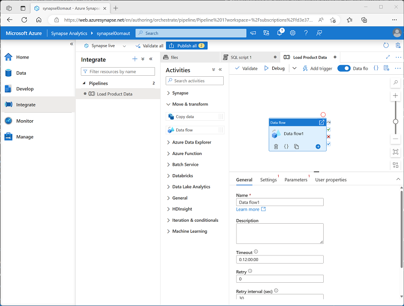
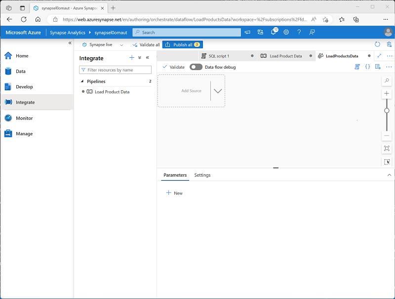

---
lab:
  title: Creación de una canalización de datos en Azure Synapse Analytics
  ilt-use: Lab
---

# Creación de una canalización de datos en Azure Synapse Analytics

En este ejercicio, cargarás datos en un grupo de SQL dedicado mediante una canalización en el Explorador de Azure Synapse Analytics. La canalización encapsulará un flujo de datos que carga los datos del producto en una tabla de un almacenamiento de datos.

Este ejercicio debería tardar en completarse **45** minutos aproximadamente.

## Antes de empezar

Necesitará una [suscripción de Azure](https://azure.microsoft.com/free) en la que tenga acceso de nivel administrativo.

## Aprovisionar un área de trabajo de Azure Synapse Analytics

Necesitarás un área de trabajo de Azure Synapse Analytics con acceso a Data Lake Storage y un grupo de SQL dedicado que hospeda un almacenamiento de datos relacional.

En este ejercicio, usarás una combinación de un script de PowerShell y una plantilla de ARM para aprovisionar un área de trabajo de Azure Synapse Analytics.

1. Inicie sesión en [Azure Portal](https://portal.azure.com) en `https://portal.azure.com`.
2. Usa el botón **[\>_]** situado a la derecha de la barra de búsqueda en la parte superior de la página para crear un nuevo Cloud Shell en Azure Portal, para lo que deberás seleccionar un entorno de ***PowerShell*** y crear almacenamiento si es necesario. Cloud Shell proporciona una interfaz de línea de comandos en un panel situado en la parte inferior de Azure Portal, como se muestra a continuación:

    

    > **Nota**: si has creado previamente un Cloud Shell que usa un entorno de *Bash*, usa el menú desplegable situado en la parte superior izquierda del panel de Cloud Shell para cambiarlo a ***PowerShell***.

3. Ten en cuenta que puedes cambiar el tamaño de Cloud Shell arrastrando la barra de separación en la parte superior del panel o usando los iconos e—, **◻** y **X** en la parte superior derecha para minimizar, maximizar y cerrar el panel. Para obtener más información sobre el uso de Azure Cloud Shell, consulte la [documentación de Azure Cloud Shell](https://docs.microsoft.com/azure/cloud-shell/overview).

4. En el panel de PowerShell, escribe los siguientes comandos para clonar este repositorio:

    ```powershell
    rm -r dp-203 -f
    git clone https://github.com/MicrosoftLearning/dp-203-azure-data-engineer dp-203
    ```

5. Una vez clonado el repositorio, escribe los siguientes comandos para cambiar a la carpeta de este laboratorio y ejecuta el script **setup.ps1** que contiene:

    ```powershell
    cd dp-203/Allfiles/labs/10
    ./setup.ps1
    ```

6. Si se solicita, elige la suscripción que quieres usar (esto solo ocurrirá si tienes acceso a varias suscripciones de Azure).
7. Cuando se solicite, escribe una contraseña adecuada que se va a establecer para el grupo de Azure Synapse SQL.

    > **Nota**: asegúrate de recordar esta contraseña.

8. Espera a que se complete el script: normalmente tarda unos 10 minutos, pero en algunos casos puede tardar más. Mientras esperas, revise el artículo [Flujos de datos en Azure Synapse Analytics](https://learn.microsoft.com/azure/synapse-analytics/concepts-data-flow-overview) en la documentación de Azure Synapse Analytics.

## Preparación de los almacenes de datos de origen y de destino

Los datos de origen de este ejercicio son un archivo de texto que contiene datos del producto. El destino es una tabla de un grupo de SQL dedicado. El objetivo es crear una canalización que encapsula un flujo de datos en el que los datos del producto del archivo se cargan en la tabla, insertando nuevos productos y actualizando los existentes.

1. Una vez completado el script, en Azure Portal, ve al grupo de recursos **dp203-*xxxxxxx*** que creó y selecciona el área de trabajo de Synapse.
2. En la página **Información general** del área de trabajo de Synapse, en la tarjeta **Abrir Synapse Studio**, selecciona **Abrir** para abrir Synapse Studio en una nueva pestaña del explorador; inicia sesión si se solicita.
3. En el lado izquierdo de Synapse Studio, usa el icono ›› para expandir el menú; se muestran las distintas páginas de Synapse Studio que usarás para administrar recursos y realizar tareas de análisis de datos.
4. En la página **Administrar**, en la pestaña **Grupos de SQL**, selecciona la fila del grupo de SQL dedicado **sql*xxxxxxx*** y usa su icono **▷** para iniciarlo; confirma que deseas reanudarlo cuando se te pida hacerlo.

     La reanudación de un grupo puede tardar varios minutos. Puedes usar el botón **↻ Actualizar** para comprobar su estado periódicamente. El estado aparecerá como **En línea** cuando esté listo. Mientras esperas, continúa con los pasos siguientes para ver los datos de origen.

5. En la página **Datos**, visualiza la pestaña **Vinculado** y comprueba que el área de trabajo incluye un vínculo a la cuenta de almacenamiento de Azure Data Lake Storage Gen2, que debe tener un nombre similar a **synapse*xxxxxxx* (Primary - datalake*xxxxxxx*)**.
6. Expande la cuenta de almacenamiento y comprueba que contiene un contenedor del sistema de archivos denominados **archivos (principal)**.
7. Selecciona el contenedor de archivos y observa que contiene una carpeta denominada **datos**.
8. Abre la carpeta **datos** y observa el archivo **Product.csv** que contiene.
9. Haz clic con el botón derecho en **Product.csv** y selecciona **Vista previa** para ver los datos que contiene. Ten en cuenta que contiene una fila de encabezado y algunos registros de datos del producto.
10. Vuelva a la página **Administrar** y asegúrate de que el grupo de SQL dedicado está ahora en línea. Si no es así, espera.
11. En la página **Datos**, en la pestaña **Área de trabajo**, expande **SQL Database**, tu **sql*xxxxxxx* (SQL)** y tus **tablas**.
12. Selecciona la tabla **dbo.DimProduct**. Después, en tu menú **menú ...**, selecciona **Nuevo script SQL** > **Seleccionar las 100 primeras filas**; que ejecutará una consulta que devuelve los datos de producto de la tabla; debe haber una sola fila.

## Implementación de una canalización

Para cargar los datos del archivo de texto en la tabla de base de datos, implementarás una canalización de Azure Synapse Analytics que contiene un flujo de datos que encapsula la lógica para ingerir los datos del archivo de texto, buscarás la columna **ProductKey** suplente para los productos que ya existen en la base de datos y luego insertarás o actualizarás filas en la tabla en consecuencia.

### Creación de una canalización con una actividad de flujo de datos

1. En Synapse Studio, selecciona la página **Integrar**. Luego, en el menú **+**, selecciona **Canalización** para crear una nueva canalización.
2. En el panel **Propiedades** de la nueva canalización, cambia su nombre de **Canalización1** a **Cargar datos de productos**. A continuación, usa el botón **Propiedades** situado encima del panel **Propiedades** para ocultarlo.
3. En el panel **Actividades**, expande **Mover y transformar**; a continuación, arrastra un **flujo de datos** a la superficie de diseño de canalización como se muestra aquí:

    

4. En la superficie de diseño de la canalización, en la pestaña **General**, establece la propiedad **Nombre** en **LoadProducts**.
5. En la pestaña **Configuración**, en la parte inferior de la lista de configuraciones, expande **Almacenamiento provisional** y establece la siguiente configuración de almacenamiento provisional:
    - **Servicio vinculado de almacenamiento provisional**: selecciona el servicio vinculado **synapse*xxxxxxx*-WorkspaceDefaultStorage**.
    - **Carpeta de almacenamiento provisional**: establece **container** en **files** y **Directory** en **stage_products**.

### Configurar el flujo de datos

1. En la parte superior de la pestaña **Configuración** del flujo de datos **LoadProducts**, en la propiedad **Flujo de datos**, selecciona **+ Nuevo**.
2. En el panel **Propiedades** de la nueva superficie de diseño de flujo de datos que se abre, establezca el **nombre** como **LoadProductsData** y, a continuación, oculta el panel **Propiedades** . El diseñador de flujo de datos debe tener este aspecto:

    

### Agregar orígenes

1. En la superficie de diseño del flujo de datos, en la lista desplegable **Agregar origen**, selecciona **Agregar origen**. Luego configura los ajustes de origen de la siguiente manera:
    - **Nombre del flujo de salida**: ProductsText
    - **Descripción**: datos de texto de productos
    - **Tipo de origen**: conjunto de datos de integración
    - **Conjunto de datos**: agrega un **nuevo** conjunto de datos con las siguientes propiedades:
        - **Tipo**: Azure Datalake Storage Gen2
        - **Formato**: texto delimitado 
        - **Nombre**: Products_Csv
        - **Servicio vinculado**: synapse*xxxxxxx*-WorkspaceDefaultStorage
        - **Ruta de acceso del archivo**: files/data/Product.csv
        - **Primera fila como encabezado**: seleccionada
        - **Importar esquema**: desde conexión/almacén
    - **Permitir desfase de esquema**: seleccionado
2. En la pestaña **Proyección** del nuevo origen **ProductsText**, establece los siguientes tipos de datos:
    - **ProductID**: cadena
    - **ProductName**: string
    - **Color**: string
    - **Tamaño**: string
    - **ListPrice**: decimal
    - **Interrumpido**: booleano
3. Agrega un segundo origen con las siguientes propiedades:
    - **Nombre del flujo de salida**: ProductTable
    - **Descripción**: tabla de productos
    - **Tipo de origen**: conjunto de datos de integración
    - **Conjunto de datos**: agrega un **nuevo** conjunto de datos con las siguientes propiedades:
        - **Tipo**: Azure Synapse Analytics
        - **Nombre**: DimProduct
        - **Servicio vinculado**: crea un **nuevo** servicio vinculado con las siguiente propiedades:
            - **Nombre**: Data_Warehouse
            - **Descripción**: grupo de SQL dedicado
            - **Conectar mediante Integration Runtime**: AutoResolveIntegrationRuntime
            - **Método de selección de cuenta**: desde la suscripción de Azure
            - **Suscripción de Azure**: selecciona tu suscripción de Azure
            - **Nombre del servidor**: synapse*xxxxxxx* (área de trabajo de Synapse)
            - **Nombre de la base de datos**: sql*xxxxxxx*
            - **** Grupo de SQL: tipo** de autenticación sql*xxxxxxx*
            **: Identidad administrada asignada por el sistema
        - **Nombre de la tabla**: dbo. DimProduct
        - **Importar esquema**: desde conexión/almacén
    - **Permitir el desfase de esquema**: seleccionado
4. En la pestaña **Proyección** del nuevo origen **ProductTable**, comprueba que se establecen los siguientes tipos de datos:
    - **ProductKey**: integer
    - **ProductAltKey**: string
    - **ProductName**: string
    - **Color**: string
    - **Tamaño**: string
    - **ListPrice**: decimal
    - **Interrumpido**: booleano
5. Comprueba que el flujo de datos contiene dos orígenes, como se muestra aquí:

    

### Agregación de una búsqueda

1. Selecciona el icono **+** situado en la parte inferior derecha del origen **ProductsText** y selecciona **Lookup**.
2. Configura las opciones de columna de la manera siguiente:
    - **Nombre del flujo de salida**: MatchedProducts
    - **Descripción**: datos de producto coincidentes
    - **Secuencia principal**: ProductText
    - **Secuencia de búsqueda**: ProductTable
    - **Coincidir varias filas**: <u>no </u>seleccionado
    - **Coincidir en**: última fila
    - **Condiciones de ordenación**: ProductKey ascendente
    - **Condiciones de búsqueda**: ProductID == ProductAltKey
3. Comprueba que el flujo de datos tenga este aspecto:

    

    La búsqueda devuelve un conjunto de columnas de *ambos* orígenes, que forman básicamente una combinación externa que hace coincidir la columna **ProductID** del archivo de texto con la columna **ProductAltKey** de la tabla del almacenamiento de datos. Cuando ya existe un producto con la clave alternativa en la tabla, el conjunto de datos incluye los valores de ambos orígenes. Cuando el producto todavía no existe en el almacenamiento de datos, el conjunto de datos contendrá valores NULL para las columnas de la tabla.

### Agregación de una alteración de fila

1. Selecciona el icono **+** situado en la parte inferior derecha de la búsqueda **matchedProducts** y selecciona **Modificar fila**.
2. Configura las opciones de alteración de fila como se muestra a continuación:
    - **Nombre del flujo de salida**: SetLoadAction
    - **Descripción**: insertar nuevo, upsert existente
    - **Flujo de entrada**: MatchedProducts
    - **Alterar condiciones de fila**: edita la condición existente y usa el botón ****+para agregar una segunda condición como se indica a continuación (recuerda que las expresiones distinguen *mayúsculas de minúsculas*):
        - InsertIf: `isNull(ProductKey)`
        - UpsertIf: `not(isNull(ProductKey))`
3. Comprueba que el flujo de datos tiene el aspecto siguiente:

    

    El paso de alteración de fila configura el tipo de acción de carga que se va a realizar para cada fila. Si no hay ninguna fila existente en la tabla (**ProductKey** es NULL), se insertará la fila del archivo de texto. Cuando ya haya una fila para el producto, se realizará un *upsert* para actualizar la fila existente. Esta configuración aplica básicamente una *actualización de dimensión de variación lenta de tipo 1*.

### Agregación de un receptor

1. Selecciona el icono **+** situado en la parte inferior derecha del paso de alteración de fila **SetLoadAction** y selecciona **Receptor**.
2. Configura las propiedades de **Receptor** de la siguiente manera:
    - **Nombre de la secuencia de salida**: DimProductTable
    - **Descripción**: tabla Load DimProduct
    - **Secuencia entrante**: SetLoadAction
    - **Tipo de receptor**: conjunto de datos de integración
    - **Conjunto de datos**: DimProduct
    - **Permitir desfase de esquema**: seleccionado
3. En la pestaña **Configuración** del nuevo receptor **DimProductTable**, especifique la siguiente configuración:
    - **Método de actualización**: selecciona **Permitir inserción** y **Permitir upsert**.
    - **Columnas de claves**: selecciona **Lista de columnas** y, a continuación, selecciona la columna **ProductAltKey** .
4. En la pestaña **Asignaciones** del nuevo receptor **DimProductTable**, desactiva la casilla **Asignación automática** y especifica <u>solo</u> las siguientes asignaciones de columnas:
    - ProductID: ProductAltKey
    - ProductsText@ProductName: ProductName
    - ProductsText@Color: Color
    - ProductsText@Size: Size
    - ProductsText@ListPrice: ListPrice
    - ProductsText@Discontinued: Discontinued
5. Comprueba que el flujo de datos tenga este aspecto:

    

## Depurar el flujo de datos

Ahora que has creado un flujo de datos en una canalización, puedes depurarlo antes de publicarlo.

1. En la parte superior del diseñador de flujo de datos, habilita **Depuración del flujo de datos**. Revisa la configuración predeterminada, selecciona **Aceptar** y espera a que se inicie el clúster de depuración (que puede tardar unos minutos).
2. En el diseñador de flujo de datos, selecciona el receptor **DimProductTable** y consulta su pestaña **Vista previa de datos**.
3. Usa el botón **↻ Actualizar** para actualizar la vista previa, lo cual ejecuta los datos a través del flujo de datos para depurarlo.
4. Revisa los datos de vista previa, teniendo en cuenta que hay una fila con una operación upsert (para el producto *AR5381*) indicada por un icono **<sub>*</sub><sup>+</sup>**  y diez filas insertadas indicadas por un icono **+**.

## Publica y ejecuta la canalización

Ya estás listo para publicar y ejecutar la canalización.

1. Use el botón **Publicar todo** para publicar la canalización (y cualquier otro recurso no guardado).
2. Una vez completada la publicación, cierra el panel del flujo de datos **LoadProductsData** y vuelve al panel de canalización  **Cargar datos del producto**.
3. En la parte superior del panel del diseñador de canalizaciones, en el menú **Agregar desencadenador**, selecciona **Desencadenar ahora**. A continuación, selecciona **Aceptar** para confirmar que desea ejecutar la canalización.

    **Nota**: También puedes crear un desencadenador para ejecutar la canalización en una hora programada o en respuesta a un evento específico.

4. Cuando se haya iniciado la ejecución de la canalización, en la página **Supervisión**, consulta la pestaña **Ejecuciones de canalización** y revisa el estado de la canalización **Cargar datos de producto**.

    La canalización puede tardar cinco minutos o más en completarse. Puedes usar el botón **↻ Actualizar** de la barra de herramientas para comprobar su estado.

5. Cuando la ejecución de la canalización se haya realizado correctamente, en la página **Datos**, usa el menú **...** para la tabla **dbo.DimProduct** en la base de datos SQL para ejecutar una consulta que seleccione las 100 primeras filas. La tabla debe contener los datos cargados por la canalización.
   
## Eliminación de recursos de Azure

Si ha terminado de explorar Azure Synapse Analytics, debe eliminar los recursos que ha creado para evitar costos innecesarios de Azure.

1. Cierre la pestaña del explorador de Synapse Studio y vuelva a Azure Portal.
2. En Azure Portal, en la página **Inicio**, seleccione **Grupos de recursos**.
3. Selecciona el grupo de recursos **dp203-*xxxxxxx*** del área de trabajo de Synapse Analytics (no el grupo de recursos administrado) y comprueba que contiene el área de trabajo de Synapse, la cuenta de almacenamiento y el grupo de SQL dedicado del área de trabajo.
4. En la parte superior de la página **Información general** del grupo de recursos, seleccione **Eliminar grupo de recursos**.
5. Escribe el nombre de grupo de recursos **dp203-*xxxxxxx*** para confirmar que quieres eliminarlo y selecciona **Eliminar**.

    Después de unos minutos, se eliminarán el grupo de recursos del área de trabajo de Azure Synapse y el grupo de recursos del área de trabajo administrada asociada a ella.
