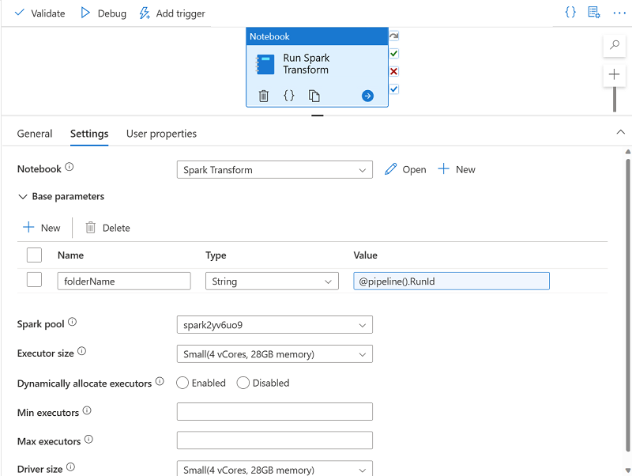

---
lab:
  title: Uso de un cuaderno de Apache Spark en una canalización
  ilt-use: Lab
---

# Uso de un cuaderno de Apache Spark en una canalización

En este ejercicio, vamos a crear una canalización de Azure Synapse Analytics que incluya una actividad para ejecutar un cuaderno de Apache Spark.

Este ejercicio debería tardar en completarse **30** minutos aproximadamente.

## Antes de empezar

Necesitará una [suscripción de Azure](https://azure.microsoft.com/free) en la que tenga acceso de nivel administrativo.

## Aprovisionar un área de trabajo de Azure Synapse Analytics

Necesitarás un área de trabajo de Azure Synapse Analytics con acceso a Data Lake Storage y a un grupo de Spark.

En este ejercicio, usarás una combinación de un script de PowerShell y una plantilla de ARM para aprovisionar un área de trabajo de Azure Synapse Analytics.

1. Inicie sesión en [Azure Portal](https://portal.azure.com) en `https://portal.azure.com`.
2. Usa el botón **[\>_]** situado a la derecha de la barra de búsqueda en la parte superior de la página para crear una nueva instancia de Cloud Shell en Azure Portal, para lo que deberás seleccionar un entorno de ***PowerShell*** y crear almacenamiento si se solicita. Cloud Shell proporciona una interfaz de línea de comandos en un panel situado en la parte inferior de Azure Portal, como se muestra a continuación:

    

    > **Nota**: si has creado previamente un Cloud Shell que usa un entorno de *Bash*, usa el menú desplegable situado en la parte superior izquierda del panel de Cloud Shell para cambiarlo a ***PowerShell***.

3. Ten en cuenta que puedes cambiar el tamaño de Cloud Shell arrastrando la barra de separación en la parte superior del panel, o usando los iconos e—, **◻** y **X** en la parte superior derecha para minimizar, maximizar y cerrar el panel. Para obtener más información sobre el uso de Azure Cloud Shell, consulte la [documentación de Azure Cloud Shell](https://docs.microsoft.com/azure/cloud-shell/overview).

4. En el panel de PowerShell, escribe los siguientes comandos para clonar este repositorio:

    ```powershell
    rm -r dp-203 -f
    git clone https://github.com/MicrosoftLearning/dp-203-azure-data-engineer dp-203
    ```

5. Una vez clonado el repositorio, escribe los siguientes comandos para cambiar a la carpeta de este laboratorio y ejecuta el script **setup.ps1** que contiene:

    ```powershell
    cd dp-203/Allfiles/labs/11
    ./setup.ps1
    ```
    
6. Si se solicita, elige la suscripción que quieres usar (esto solo ocurrirá si tienes acceso a varias suscripciones de Azure).
7. Cuando se te solicite, escribe una contraseña adecuada que se va a establecer para el grupo de SQL de Azure Synapse.

    > **Nota**: Asegúrate de recordar esta contraseña.

8. Espera a que se complete el script: normalmente tarda unos 10 minutos, pero en algunos casos puede tardar más. Mientras esperas, revise el artículo [Canalizaciones de Azure Synapse](https://learn.microsoft.com/en-us/azure/data-factory/concepts-data-flow-performance-pipelines) en la documentación de Azure Synapse Analytics.

## Ejecución de un cuaderno de Spark de forma interactiva

Antes de automatizar un proceso de transformación de datos con un cuaderno, puede resultar útil ejecutar el cuaderno de forma interactiva para comprender mejor el proceso que vas a automatizar más adelante.

1. Una vez completado el script, en Azure Portal, ve al grupo de recursos dp203-xxxxxxx que creó y selecciona el área de trabajo de Synapse.
2. En la página **Información general** del área de trabajo de Synapse, en la tarjeta **Abrir Synapse Studio**, selecciona **Abrir** para abrir Synapse Studio en una nueva pestaña del explorador; inicia sesión si se solicita.
3. En el lado izquierdo de Synapse Studio, usa el icono ›› para expandir el menú; esto muestra las distintas páginas de Synapse Studio.
4. En la página **Datos**, visualiza la pestaña Vinculado y comprueba que el área de trabajo incluye un vínculo a la cuenta de almacenamiento de Azure Data Lake Storage Gen2, que debe tener un nombre similar a **synapsexxxxxxxxxx (Primary - datalakexxxxxxx)**.
5. Expande la cuenta de almacenamiento y comprueba que contiene un contenedor del sistema de archivos denominados **archivos (principal)**.
6. Selecciona el contenedor de archivos y ten en cuenta que contiene una carpeta denominada **data**, que contiene los archivos de datos que vas a transformar.
7. Abre la carpeta **data*** y ve los archivos CSV que contiene. Haz clic con el botón derecho en cualquiera de los archivos y selecciona **Vista previa** para ver un ejemplo de los datos. Cierra la vista previa cuando termine.
8. Haz clic con el botón derecho en cualquiera de los archivos y selecciona **Vista previa** para ver los datos que contiene. Ten en cuenta que los archivos contienen una fila de encabezado, por lo que puedes seleccionar la opción de mostrar los encabezados de columna.
9. Cierre la vista preliminar. A continuación, descargue **Spark Transform.ipynb** [desde Allfiles/labs/11/notebooks](https://github.com/MicrosoftLearning/dp-203-azure-data-engineer/tree/master/Allfiles/labs/11/notebooks)

    > **Nota**: Es mejor copiar este texto con ***Ctrl+a*** y luego ***Ctrl+c*** y pegarlo en una herramienta con ***Ctrl+v***, como por ejemplo, el cuaderno y luego con archivo, guardar como **Spark Transform.ipynb** con el tipo de archivo ***Todos los archivos***. También tiene la opción de seleccionar el archivo en GitHub y, a continuación, seleccionar los puntos suspensivos (...) y, después, seleccionar **Descargar**, guardarlo en una ubicación que pueda recordar. 
    

10 Después, en la página **Desarrollar**, expanda **Cuadernos** y haga clic en las opciones de "+ Importar" 
    
        
1. Selecciona el archivo que acabas de descargar y guardar como **Spark Transfrom.ipynb**.
2. Asocia el cuaderno a tu grupo **spark*xxxxxxx*** de Spark.
3. Revisa las notas del cuaderno y ejecuta las celdas de código.

    > **Nota**: La primera celda de código tardará unos minutos en ejecutarse porque debe iniciarse el grupo de Spark. Las células posteriores se ejecutarán más rápido.
4. Revisa el código que contiene el cuaderno, teniendo en cuenta que:
    - Establece una variable para definir un nombre de carpeta único.
    - Carga los datos del pedido de ventas CSV desde la carpeta **/data**.
    - Transforma los datos dividiendo el nombre del cliente en varios campos.
    - Guarda los datos transformados en formato Parquet en la carpeta con nombre único.
5. En la barra de herramientas del cuaderno, adjunta el cuaderno al grupo de Spark **spark*xxxxxxx*** y luego usa el botón **▷ Ejecutar Todo** para ejecutar todas las celdas de código del cuaderno.
  
    La sesión de Spark puede tardar unos minutos en iniciarse antes de que se puedan ejecutar las celdas de código.

6. Una vez ejecutadas todas las celdas del cuaderno, anota el nombre de la carpeta en la que se han guardado los datos transformados.
7. Cambie a la  pestaña **archivos** (que todavía debe estar abierta) y ve la carpeta **files** raíz. Si es necesario, en el menú **Más**, selecciona **Actualizar** para ver la nueva carpeta. Después, ábrelo para comprobar que contiene archivos Parquet.
8. Vuelva a la carpeta **archivos** raíz y después selecciona la carpeta con nombre única generada por el cuaderno y, en el menú ** Nuevo script SQL**, selecciona **Seleccionar las 100 primeras filas**.
9. En el panel **Seleccionar las 100 primeras filas**, establece el tipo de archivo en el **formato Parquet** y aplica el cambio.
10. En el nuevo panel de script de SQL que se abre, usa el botón **▷ Ejecutar** para ejecutar el código SQL y comprobar que devuelve los datos de pedidos de ventas transformados.

## Ejecución del cuaderno en una canalización

Ahora que comprendes el proceso de transformación, estás listo para automatizarlo encapsulando el cuaderno en una canalización.

### Creación de una celda de parámetros

1. En Synapse Studio, vuelva a la pestaña **Transformación de Spark** que contiene el cuaderno y, en la barra de herramientas, en el  menú **...** del lado derecho, selecciona **Borrar salida**.
2. Selecciona la primera celda de código (que contiene el código para establecer la variable **folderName**).
3. En la barra de herramientas emergente de la parte superior derecha de la celda de código, en el menú **...**, selecciona **\[@] Alternar celda de parámetro**. Comprueba que la palabra **parámetros** aparece en la parte inferior derecha de la celda.
4. En la barra de herramientas, usa el botón **Publicar** para guardar los cambios.

### Crear una canalización

1. En Synapse Studio, selecciona la página **Integrar**. Después, en el menú **+**, selecciona **Canalización** para crear una canalización.
2. En el panel **Propiedades** de la nueva canalización, cambie su nombre de **Canalización1** a **Transformar datos de ventas**. Después, usa el botón **Propiedades** situado encima del panel **Propiedades** para ocultarlo.
3. En el  panel **Actividades**, expande **Synapse** y después arrastra una actividad **Cuaderno** a la superficie de diseño de canalización, como se muestra aquí:

    

4. 
5. En la pestaña **General** de la actividad de cuaderno, cambie su nombre por **Ejecutar transformación de Spark**.
6. En la pestaña **Configuración** de la actividad de cuaderno, establece las siguientes propiedades:
    - **Cuaderno**: selecciona el cuaderno **Transformación de Spark**.
    - **Parámetros base**: expande esta sección y define un parámetro con la siguiente configuración:
        - **Nombre**: folderName
        - **Tipo**: Cadena
        - **Valor**: selecciona **Incorporación de contenido dinámico** y establece el valor del parámetro en la variable del sistema *Id. de ejecución de canalización* (`@pipeline().RunId`)
    - **Grupo de Spark**: selecciona el grupo **spark*xxxxxxx***.
    - **Tamaño del ejecutor**: selecciona **Pequeño (4 núcleos virtuales, 28 GB de memoria)**.

    El panel de canalización debe tener un aspecto similar al siguiente:

    

### Publicar y ejecutar la canalización

1. Usa el botón **Publicar todo** para publicar la canalización (y cualquier otro recurso no guardado).
2. En la parte superior del panel del diseñador de canalizaciones, en el menú **Agregar desencadenador**, selecciona **Desencadenar ahora**. A continuación, selecciona **Aceptar** para confirmar que desea ejecutar la canalización.

    **Nota**: también puedes crear un desencadenador para ejecutar la canalización en una hora programada o en respuesta a un evento específico.

3. Al iniciarse la ejecución de la canalización, en la página **Supervisión**, visualiza la pestaña Ejecuciones de canalización**** y revisa el estado de la canalización **Transformar datos de ventas**.
4. Selecciona la canalización **Transformar datos de ventas** para ver sus detalles y anota el identificador de ejecución de canalización en el panel **Ejecuciones de actividad**.

    La canalización puede tardar cinco minutos o más en completarse. Puedes usar el botón **#↻ Actualizar** de la barra de herramientas para comprobar su estado.

5. Cuando la ejecución de la canalización se haya realizado correctamente, en la página **Datos**, ve al contenedor de almacenamiento **files ** y comprueba que se ha creado una nueva carpeta con el nombre del identificador de ejecución de la canalización y que contiene archivos Parquet para los datos de ventas transformados.
   
## Eliminación de recursos de Azure

Si ha terminado de explorar Azure Synapse Analytics, debe eliminar los recursos que ha creado para evitar costos innecesarios de Azure.

1. Cierre la pestaña del explorador de Synapse Studio y vuelva a Azure Portal.
2. En Azure Portal, en la página **Inicio**, seleccione **Grupos de recursos**.
3. Selecciona el grupo de recursos **dp203-*xxxxxxx*** para tu área de trabajo de Synapse Analytics (no el grupo de recursos administrados) y verifica que contiene el área de trabajo de Synapse, la cuenta de almacenamiento y el grupo de Spark para tu área de trabajo.
4. En la parte superior de la página **Información general** del grupo de recursos, seleccione **Eliminar grupo de recursos**.
5. Especifica el nombre del grupo de recursos **dp203-*xxxxxxx*** para confirmar que quieres eliminarlo y selecciona **Eliminar**.

    Después de unos minutos, se eliminarán el grupo de recursos de área de trabajo de Azure Synapse y el grupo de recursos de área de trabajo administrado asociado a él.
