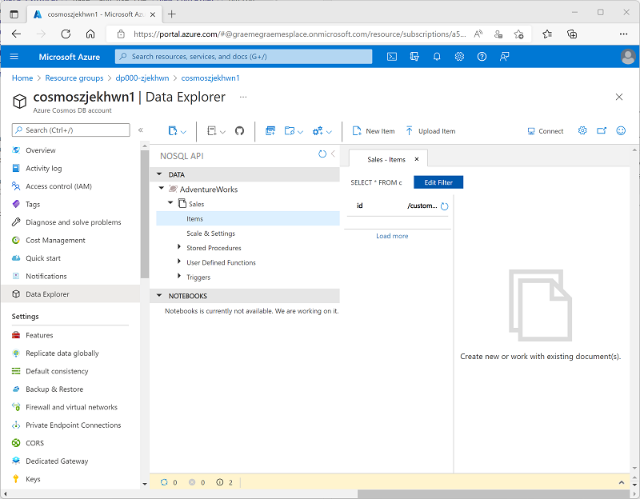

---
lab:
  title: "Uso de Azure Synapse Link para Azure Cosmos\_DB"
  ilt-use: Lab
---

# Uso de Azure Synapse Link para Azure Cosmos DB

Azure Synapse Link para Azure Cosmos DB es una tecnología de *procesamiento analítico transaccional híbrido* (HTAP) nativa en la nube que permite ejecutar un análisis casi en tiempo real de datos operativos almacenados en Azure Cosmos DB.

Este ejercicio debería tardar aproximadamente **35** minutos en completarse.

## Antes de empezar

Necesitará una [suscripción de Azure](https://azure.microsoft.com/free) en la que tenga acceso de nivel administrativo.

## Aprovisionamiento de los recursos de Azure

Para explorar Azure Synapse Link para Azure Cosmos DB, necesitarás un área de trabajo de Azure Synapse Analytics y una cuenta de Azure Cosmos DB. En este ejercicio, usarás una combinación de un script de PowerShell y una plantilla de ARM para aprovisionar estos recursos en la suscripción de Azure.

1. Inicie sesión en [Azure Portal](https://portal.azure.com) en `https://portal.azure.com`.
2. Usa el botón **[\>_]** situado a la derecha de la barra de búsqueda en la parte superior de la página para crear un nuevo Cloud Shell en Azure Portal, para lo que deberás seleccionar un entorno de ***PowerShell*** y crear almacenamiento si es necesario. Cloud Shell proporciona una interfaz de línea de comandos en un panel situado en la parte inferior de Azure Portal, como se muestra a continuación:

    

    > **Nota**: Si anteriormente creaste un Cloud Shell que usa un entorno de *Bash*, usa el menú desplegable situado en la parte superior izquierda del panel de Cloud Shell para cambiarlo a ***PowerShell***.

3. Tenga en cuenta que puede cambiar el tamaño de Cloud Shell arrastrando la barra de separación en la parte superior del panel, o usando los iconos **&#8212;** , **&#9723;** y **X** en la parte superior derecha para minimizar, maximizar y cerrar el panel. Para obtener más información sobre el uso de Azure Cloud Shell, consulte la [documentación de Azure Cloud Shell](https://docs.microsoft.com/azure/cloud-shell/overview).

4. En el panel de PowerShell, escribe los siguientes comandos para clonar este repositorio:

    ```
    rm -r dp-203 -f
    git clone https://github.com/MicrosoftLearning/dp-203-azure-data-engineer dp-203
    ```

5. Una vez clonado el repositorio, escribe los siguientes comandos para cambiar a la carpeta de este ejercicio y ejecuta el script **setup.ps1** que contiene:

    ```
    cd dp-203/Allfiles/labs/14
    ./setup.ps1
    ```

6. Si se solicita, elige la suscripción que quieres usar (esto solo ocurrirá si tienes acceso a varias suscripciones de Azure).
7. Cuando se solicite, escribe una contraseña adecuada que se va a establecer para el grupo de Azure Synapse SQL.

    > **Nota**: Asegúrate de recordar esta contraseña.

8. Espera a que se complete el script: normalmente tarda unos 10 minutos, pero en algunos casos puede tardar más. Mientras esperas, consulta el artículo [¿Qué es Azure Synapse Link para Azure Cosmos DB (versión preliminar)?](https://docs.microsoft.com/azure/cosmos-db/synapse-link) en la documentación de Azure Synapse Analytics.

## Configuración de Synapse Link en Azure Cosmos DB

Para poder usar Synapse Link para Azure Cosmos DB, debes habilitarlo en la cuenta de Azure Cosmos DB y configurar un contenedor como almacén analítico.

### Habilitación de Azure Synapse Link para tu cuenta de Cosmos DB

1. En [Azure Portal](https://portal.azure.com), ve al grupo de recursos **dp203-*xxxxxxx*** que creó el script de configuración e identifica la cuenta **cosmos*xxxxxxxx*** de Cosmos DB.

    > **Nota**: En algunos casos, el script puede haber intentado crear cuentas de Cosmos DB en varias regiones, por lo que puede haber una o varias cuentas en un estado de *eliminación*. La cuenta activa debe ser la que tenga el número más grande al final de su nombre; por ejemplo, **cosmos*xxxxxxx*3**.

2. Abre la cuenta de Azure Cosmos DB y selecciona la página **Explorador de datos** en el lado izquierdo de su hoja.

    *Si se muestra un cuadro de diálogo de **Bienvenida**, ciérralo*.

3. En la parte superior de la página **Explorador de datos**, utiliza el botón **Habilitar Azure Synapse Link** para habilitar Synapse Link.

    

4. En el lado izquierdo de la página, en la sección **Integraciones**, selecciona la página **Azure Synapse Link** y comprueba que el estado de la cuenta está *habilitado*.

### Creación de un contenedor habilitado para el contenedor de almacenamiento

1. Vuelve a la página **Explorador de datos** y usa el botón (o icono) **Nuevo contenedor** para crear un contenedor con la siguiente configuración:
    - **Id. de base de datos**: *(Crear nuevo)* AdventureWorks
    - **Compartir rendimiento entre contenedores**: <u>no </u>seleccionado
    - **Id. de contenedor**: ventas
    - **Clave de partición**: /customerid
    - **Rendimiento del contenedor (escalado automático):** escalado automático
    - **Número máximo de RU/s de contenedor**: 4000
    - **Almacén analítico**: activado

    > **Nota**: En este escenario se usa **customerid** para la clave de partición, ya que sirve para muchas de las consultas que se usan para recuperar la información de pedidos de ventas y clientes en nuestra aplicación. Tiene una cardinalidad (número de valores únicos) relativamente alta y, por lo tanto, permite que el contenedor se escale a medida que crece el número de clientes y los pedidos de venta. Utilizar el escalado automático y establecer el valor máximo en 4000 RU/s es apropiado para una nueva aplicación que tenga volúmenes de consulta inicialmente bajos. Con un valor máximo de 4000 RU/s, el contenedor escalará hacia abajo automáticamente entre ese valor y el 10 % de ese valor máximo (400 RU/s) cuando no sea necesario.

2. Una vez creado el contenedor, en la página **Explorador de datos**, expande la base de datos **AdventureWorks** y su carpeta **Ventas**. Luego selecciona la carpeta **Elementos**.

    

3. Usa el botón **Nuevo elemento** para crear un nuevo elemento de cliente basado en el siguiente JSON. A continuación, guarda el nuevo elemento (se añadirán algunos campos de metadatos adicionales al guardar el elemento).

    ```json
    {
        "id": "SO43701",
        "orderdate": "2019-07-01",
        "customerid": 123,
        "customerdetails": {
            "customername": "Christy Zhu",
            "customeremail": "christy12@adventure-works.com"
        },
        "product": "Mountain-100 Silver, 44",
        "quantity": 1,
        "price": 3399.99
    }
    ```

4. Agrega un segundo elemento con el siguiente JSON:

    ```json
    {
        "id": "SO43704",
        "orderdate": "2019-07-01",
        "customerid": 124,
        "customerdetails": {
            "customername": "Julio Ruiz",
            "customeremail": "julio1@adventure-works.com"
        },
        "product": "Mountain-100 Black, 48",
        "quantity": 1,
        "price": 3374.99
    }
    ```

5. Agrega un tercer elemento con el siguiente JSON:

    ```json
    {
        "id": "SO43707",
        "orderdate": "2019-07-02",
        "customerid": 125,
        "customerdetails": {
            "customername": "Emma Brown",
            "customeremail": "emma3@adventure-works.com"
        },
        "product": "Road-150 Red, 48",
        "quantity": 1,
        "price": 3578.27
    }
    ```

> **Nota**: En realidad, el almacén analítico contendrá un volumen mucho mayor de datos que una aplicación escribirá en el almacén. Estos pocos elementos serán suficientes para demostrar el principio de este ejercicio.

## Configurar Synapse Link en Azure Synapse Analytics

Ahora que has preparado la cuenta de Azure Cosmos DB, puedes configurar el vínculo de Azure Synapse para Azure Cosmos DB en el área de trabajo de Azure Synapse Analytics.

1. En Azure Portal, cierra la hoja de la cuenta de Cosmos DB si todavía está abierta y vuelve al grupo de recursos **dp203-*xxxxxxx***.
2. Abre el área de trabajo **synapse*xxxxxxx*** de Synapse y, en la página **Información general**, en la tarjeta **Abrir Synapse Studio**, selecciona **Abrir** para abrir Synapse Studio en una nueva pestaña del explorador; inicia sesión si se te solicita.
3. En el lado izquierdo de Synapse Studio, usa el icono **&rsaquo;&rsaquo;** para expandir el menú. Se mostrarán las distintas páginas de Synapse Studio.
4. En la página **Datos**, mira la pestaña **Vinculado**. El área de trabajo ya debe incluir un vínculo a la cuenta de almacenamiento de Azure Data Lake Storage Gen2, pero no a la cuenta de Cosmos DB.
5. En el menú **+**, selecciona **Conectar a datos externos** y, a continuación, selecciona **Azure Cosmos DB para NoSQL**.

    

6. Continúa y crea una nueva conexión de Cosmos DB con la siguiente configuración:
    - **Nombre**: AdventureWorks
    - **Descripción**: Base de datos AdventureWorks Cosmos DB
    - **Conectar mediante Integration Runtime**: AutoResolveIntegrationRuntime
    - **Tipo de autenticación**: clave de cuenta
    - **Cadena de conexión**: *seleccionada*
    - **Método de selección de cuenta**: desde la suscripción
    - **Suscripción de Azure**: *selecciona tu suscripción de Azure*
    - **Nombre de cuenta de Azure Cosmos DB**: *selecciona tu cuenta **cosmosxxxxxxx***
    - **Nombre de la base de datos**: AdventureWorks
7. Después de crear la conexión, usa el botón **↻** situado en la parte superior derecha de la página **Datos** para actualizar la vista hasta que aparezca una categoría **Azure Cosmos DB** en el panel **Vinculado**.
8. Expande la categoría **Azure Cosmos DB** para ver la conexión **AdventureWorks** que creaste y el contenedor **Ventas** que contiene.

    

## Consultar Azure Cosmos DB desde Azure Synapse Analytics

Ahora estás listo para consultar la base de datos de Cosmos DB desde Azure Synapse Analytics.

### Consulta de Azure Cosmos DB desde un grupo de Spark

1. En el panel **Datos**, selecciona el contenedor **Ventas** y, en el menú **...**, selecciona **Nuevo cuaderno** > **Cargar en DataFrame**.
2. En la nueva pestaña **Cuaderno 1** que se abre, en la lista **Adjuntar a**, selecciona el grupo de Spark (**spark*xxxxxxx***). A continuación, usa el botón **▷ Ejecutar todo** para ejecutar todas las celdas del cuaderno (actualmente solo hay una).

    Dado que esta es la primera vez que has ejecutado código de Spark en esta sesión, se debe iniciar el grupo de Spark. Esto significa que la primera ejecución de la sesión puede tardar unos minutos. Las ejecuciones posteriores serán más rápidas.

3. Mientras esperas a que se inicialice la sesión de Spark, revisa el código que se generó (puedes usar el botón **Propiedades**, que tiene un aspecto similar a **<sub>*</sub>**, en el extremo derecho de la barra de herramientas para cerrar el panel **Propiedades** y ver el código más claramente). El código debería ser similares a lo siguiente:

    ```python
    # Read from Cosmos DB analytical store into a Spark DataFrame and display 10 rows from the DataFrame
    # To select a preferred list of regions in a multi-region Cosmos DB account, add .option("spark.cosmos.preferredRegions", "<Region1>,<Region2>")

    df = spark.read\
        .format("cosmos.olap")\
        .option("spark.synapse.linkedService", "AdventureWorks")\
        .option("spark.cosmos.container", "Sales")\
        .load()

    display(df.limit(10))
    ```

4. Espera a que el código termine de ejecutarse y, a continuación, revisa la salida debajo de la celda del cuaderno. Los resultados deben incluir tres registros; uno para cada uno de los elementos que agregaste a la base de datos de Cosmos DB. Cada registro incluye los campos especificados al crear los elementos, así como algunos de los campos de metadatos que se generaron automáticamente.
5. Debajo de los resultados de la celda anterior, usa el icono **+ Código** para agregar una nueva celda al cuaderno, y luego escribe en ella el código siguiente:

    ```python
    customer_df = df.select("customerid", "customerdetails")
    display(customer_df)
    ```

6. Usa el icono **▷** a la izquierda de la celda para ejecutarlo y ver los resultados, que deben ser similares a estos:

    | customerid | customerdetails |
    | -- | -- |
    | 124 | "{"customername": "Julio Ruiz","customeremail": "julio1@adventure-works.com"}" |
    | 125 | "{"customername": "Emma Brown","customeremail": "emma3@adventure-works.com"}" |
    | 123 | "{"customername": "Christy Zhu","customeremail": "christy12@adventure-works.com"}" |

    Esta consulta creó una nueva trama de datos que contiene solo las columnas **customerid** y **customerdetails**. Observa que la columna **customerdetails** contiene la estructura JSON de los datos anidados en el elemento de origen. En la tabla de resultados que se muestra, puedes utilizar el icono **►** que aparece junto al valor JSON para expandirlo y ver los campos individuales que contiene.

7. Agrega otra nueva celda de código y escribe el siguiente código:

    ```python
    customerdetails_df = df.select("customerid", "customerdetails.*")
    display(customerdetails_df)
    ```

8. Ejecuta la celda y revisa los resultados, que deberían incluir el **customername** y **customeremail** del valor **customerdetails** como columnas:

    | customerid | customername | customeremail |
    | -- | -- | -- |
    | 124 | Julio Ruiz |julio1@adventure-works.com |
    | 125 | Emma Brown |emma3@adventure-works.com |
    | 123 | Christy Zhu | christy12@adventure-works.com |

    Spark permite ejecutar código complejo de manipulación de datos para reestructurar y explorar los datos de Cosmos DB. En este caso, el lenguaje PySpark permite navegar por la jerarquía de propiedades JSON para recuperar los campos secundarios del campo **customerdetails**.

9. Agrega otra nueva celda de código y escribe el siguiente código:

    ```sql
    %%sql

    -- Create a logical database in the Spark metastore
    CREATE DATABASE salesdb;

    USE salesdb;

    -- Create a table from the Cosmos DB container
    CREATE TABLE salesorders using cosmos.olap options (
        spark.synapse.linkedService 'AdventureWorks',
        spark.cosmos.container 'Sales'
    );

    -- Query the table
    SELECT *
    FROM salesorders;
    ```

10. Ejecuta la nueva celda para crear una nueva base de datos que contenga una tabla con los datos del almacén analítico de Cosmos DB.
11. Agrega otra nueva celda de código y luego escribe y ejecuta el siguiente código:

    ```sql
    %%sql

    SELECT id, orderdate, customerdetails.customername, product
    FROM salesorders
    ORDER BY id;
    ```

    Los resultados de esta consulta deberían ser similares a los siguientes:

    | id | orderdate | customername | producto |
    | -- | -- | -- | -- |
    | SO43701 | 2019-07-01 | Christy Zhu | Mountain-100 Silver, 44 |
    | SO43704 | 2019-07-01 | Julio Ruiz |Mountain-100 Black, 48 |
    | SO43707 | 02/07/2019 | Emma Brown |Road-150 Red, 48 |

    Observa que al utilizar Spark SQL, puedes recuperar propiedades con nombre de una estructura JSON como columnas.

12. Mantén abierta la pestaña **Cuaderno 1**: volverás a ella más adelante.

### Consulta de Azure Cosmos DB desde un grupo de SQL sin servidor

1. En el panel **Datos**, selecciona el contenedor **Ventas**, y en su menú **...**, selecciona **Nuevo script SQL** > **Seleccionar las 100 primeras filas**.
2. En la pestaña **SQL script 1** que se abre, oculta el panel **Propiedades** y observa el código que se ha generado, que debería ser similar a este:

    ```sql
    IF (NOT EXISTS(SELECT * FROM sys.credentials WHERE name = 'cosmosxxxxxxxx'))
    THROW 50000, 'As a prerequisite, create a credential with Azure Cosmos DB key in SECRET option:
    CREATE CREDENTIAL [cosmosxxxxxxxx]
    WITH IDENTITY = ''SHARED ACCESS SIGNATURE'', SECRET = ''<Enter your Azure Cosmos DB key here>''', 0
    GO

    SELECT TOP 100 *
    FROM OPENROWSET(PROVIDER = 'CosmosDB',
                    CONNECTION = 'Account=cosmosxxxxxxxx;Database=AdventureWorks',
                    OBJECT = 'Sales',
                    SERVER_CREDENTIAL = 'cosmosxxxxxxxx'
    ) AS [Sales]
    ```

    El grupo de SQL requiere una credencial para acceder a Cosmos DB, que se basa en una clave de autorización para la cuenta de Cosmos DB. El script incluye una instrucción inicial `IF (NOT EXISTS(...` que comprueba esta credencial y produce un error si no existe.

3. Reemplaza la instrucción `IF (NOT EXISTS(...` en el script por el siguiente código para crear una credencial, sustituyendo *cosmosxxxxxxxx* por el nombre de la cuenta de Cosmos DB:

    ```sql
    CREATE CREDENTIAL [cosmosxxxxxxxx]
    WITH IDENTITY = 'SHARED ACCESS SIGNATURE',
    SECRET = '<Enter your Azure Cosmos DB key here>'
    GO
    ```

    El script completo debería ser similar al siguiente:

    ```sql
    CREATE CREDENTIAL [cosmosxxxxxxxx]
    WITH IDENTITY = 'SHARED ACCESS SIGNATURE',
    SECRET = '<Enter your Azure Cosmos DB key here>'
    GO

    SELECT TOP 100 *
    FROM OPENROWSET(PROVIDER = 'CosmosDB',
                    CONNECTION = 'Account=cosmosxxxxxxxx;Database=AdventureWorks',
                    OBJECT = 'Sales',
                    SERVER_CREDENTIAL = 'cosmosxxxxxxxx'
    ) AS [Sales]
    ```

4. Cambia a la pestaña del explorador que contiene Azure Portal (o abre una nueva pestaña e inicia sesión en Azure Portal en [https://portal.azure.com](https://portal.azure.com)). A continuación, en el grupo de recursos **dp203-*xxxxxxx***, abre la cuenta **cosmos*xxxxxxxx*** de Azure Cosmos DB.
5. En el panel de la izquierda, en la sección **Configuración**, selecciona la página **Claves**. A continuación, copia el valor de **Clave principal** al portapapeles.
6. Vuelve a la pestaña del explorador que contiene el script SQL en Azure Synapse Studio y pega la clave en el código, reemplazando el marcador de posición ***\<Enter your Azure Cosmos DB key here\>*** para que el script tenga un aspecto similar al siguiente:

    ```sql
    CREATE CREDENTIAL [cosmosxxxxxxxx]
    WITH IDENTITY = 'SHARED ACCESS SIGNATURE',
    SECRET = '1a2b3c....................................=='
    GO

    SELECT TOP 100 *
    FROM OPENROWSET(PROVIDER = 'CosmosDB',
                    CONNECTION = 'Account=cosmosxxxxxxxx;Database=AdventureWorks',
                    OBJECT = 'Sales',
                    SERVER_CREDENTIAL = 'cosmosxxxxxxxx'
    ) AS [Sales]
    ```

7. Usa el botón **▷ Ejecutar** para ejecutar el script y revisa los resultados, que deberían incluir tres registros; uno para cada uno de los elementos que agregaste a la base de datos de Cosmos DB.

    Ahora que has creado la credencial, puedes utilizarla en cualquier consulta en el origen de datos de Cosmos DB.

8. Reemplaza todo el código del script (tanto las instrucciones CREATE CREDENTIAL como SELECT) por el código siguiente (sustituyendo *cosmosxxxxxxxx* con el nombre de la cuenta de Azure Cosmos DB):

    ```sql
    SELECT *
    FROM OPENROWSET(PROVIDER = 'CosmosDB',
                    CONNECTION = 'Account=cosmosxxxxxxxx;Database=AdventureWorks',
                    OBJECT = 'Sales',
                    SERVER_CREDENTIAL = 'cosmosxxxxxxxx'
    )
    WITH (
        OrderID VARCHAR(10) '$.id',
        OrderDate VARCHAR(10) '$.orderdate',
        CustomerID INTEGER '$.customerid',
        CustomerName VARCHAR(40) '$.customerdetails.customername',
        CustomerEmail VARCHAR(30) '$.customerdetails.customeremail',
        Product VARCHAR(30) '$.product',
        Quantity INTEGER '$.quantity',
        Price FLOAT '$.price'
    )
    AS sales
    ORDER BY OrderID;
    ```

9. Ejecuta el script y revisa los resultados, que deben coincidir con el esquema definido en la cláusula `WITH`:

    | OrderID | OrderDate | CustomerID | CustomerName | CustomerEmail | Producto | Quantity | Precio |
    | -- | -- | -- | -- | -- | -- | -- | -- |
    | SO43701 | 2019-07-01 | 123 | Christy Zhu | christy12@adventure-works.com | Mountain-100 Silver, 44 | 1 | 3399,99 |
    | SO43704 | 2019-07-01 | 124 | Julio Ruiz | julio1@adventure-works.com | Mountain-100 Black, 48 | 1 | 3374,99 |
    | SO43707 | 02/07/2019 | 125 | Emma Brown | emma3@adventure-works.com | Road-150 Red, 48 | 1 | 3578,27 |

10. Mantén abierta la pestaña **Script de SQL 1**: volverás a ella más adelante.

### Comprobación de que las modificaciones de datos en Cosmos DB se reflejan en Synapse 

1. Si se deja abierta la pestaña del explorador que contiene Synapse Studio, se vuelve a la pestaña que contiene Azure Portal, que debe abrirse en la página **Claves** de la cuenta de Cosmos DB.
2. En la página **Explorador de datos**, expande la base de datos de **AdventureWorks** y su carpeta **Ventas** y después selecciona la carpeta **Elementos**.
3. Usa el botón **Nuevo elemento** para crear un nuevo elemento de cliente basado en el siguiente JSON. Después, guarda el nuevo elemento (al guardar el elemento, se añadirán algunos campos de metadatos adicionales).

    ```json
    {
        "id": "SO43708",
        "orderdate": "2019-07-02",
        "customerid": 126,
        "customerdetails": {
            "customername": "Samir Nadoy",
            "customeremail": "samir1@adventure-works.com"
        },
        "product": "Road-150 Black, 48",
        "quantity": 1,
        "price": 3578.27
    }
    ```

4. Vuelve a la pestaña Synapse Studio y en la pestaña **Script de SQL 1**, vuelve a ejecutar la consulta. Inicialmente, puede mostrar los mismos resultados que antes, pero espera un minuto o así y vuelve a ejecutar la consulta hasta que los resultados incluyan la venta a Samir Nadoy el 07-02-2019.
5. Vuelve a la pestaña **Notebook 1** y vuelve a ejecutar la última celda del cuaderno de Spark para comprobar que la venta a Samir Nadoy ahora está incluida en los resultados de la consulta.

## Eliminación de recursos de Azure

Si ha terminado de explorar Azure Synapse Analytics, debe eliminar los recursos que ha creado para evitar costos innecesarios de Azure.

1. Cierre la pestaña del explorador de Synapse Studio y vuelva a Azure Portal.
2. En Azure Portal, en la página **Inicio**, seleccione **Grupos de recursos**.
3. Selecciona el grupo de recursos **dp203-*xxxxxxx*** del área de trabajo de Synapse Analytics (no el grupo de recursos administrado) y comprueba que contiene el área de trabajo de Synapse, la cuenta de almacenamiento y el grupo de Spark del área de trabajo así como tu cuenta de Azure Cosmos DB.
4. En la parte superior de la página **Información general** del grupo de recursos, seleccione **Eliminar grupo de recursos**.
5. Escribe el nombre del grupo de recursos **dp203-*xxxxxxx*** para confirmar que quieres eliminarlo y selecciona **Eliminar**.

    Después de unos minutos, tu grupo de recursos del área de trabajo de Azure Synapse y el grupo de recursos del área de trabajo administrada asociado se eliminarán.
