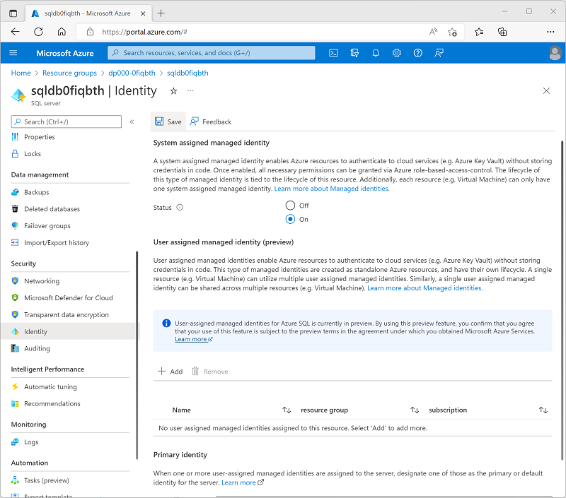

---
lab:
  title: Usa Azure Synapse Link para SQL
  ilt-use: Suggested demo
---

# Usa Azure Synapse Link para SQL

Azure Synapse Link para SQL te permite sincronizar automáticamente una base de datos transaccional en SQL Server o Azure SQL Database con un grupo de SQL dedicado en Azure Synapse Analytics. Esta sincronización te permite realizar cargas de trabajo analíticas de baja latencia en Synapse Analytics y evitar la sobrecarga de consultas en la base de datos operativa de origen.

Este ejercicio debería tardar en completarse **35** minutos aproximadamente.

## Antes de empezar

Necesitará una [suscripción de Azure](https://azure.microsoft.com/free) en la que tenga acceso de nivel administrativo.

## Aprovisionamiento de los recursos de Azure

En este ejercicio, sincronizarás los datos de un recurso de Azure SQL Database con un área de trabajo de Azure Synapse Analytics. Empezarás con un script para aprovisionar estos recursos en tu suscripción de Azure.

1. Inicie sesión en [Azure Portal](https://portal.azure.com) en `https://portal.azure.com`.
2. Usa el botón **[\>_]** situado a la derecha de la barra de búsqueda en la parte superior de la página para crear una nueva instancia de Cloud Shell en Azure Portal, para lo que deberás seleccionar un entorno de ***PowerShell*** y crear almacenamiento si se solicita. Cloud Shell proporciona una interfaz de línea de comandos en un panel situado en la parte inferior de Azure Portal, como se muestra a continuación:

    

    > **Nota**: Si creaste anteriormente un Cloud Shell que usa un entorno de *Bash*, usa el menú desplegable situado en la parte superior izquierda del panel de Cloud Shell para cambiarlo a ***PowerShell***.

3. Tenga en cuenta que puede cambiar el tamaño de Cloud Shell arrastrando la barra de separación en la parte superior del panel, o usando los iconos **&#8212;** , **&#9723;** y **X** en la parte superior derecha para minimizar, maximizar y cerrar el panel. Para obtener más información sobre el uso de Azure Cloud Shell, consulte la [documentación de Azure Cloud Shell](https://docs.microsoft.com/azure/cloud-shell/overview).

4. En el panel de PowerShell, esscribe los siguientes comandos para clonar este repositorio:

    ```
    rm -r dp-203 -f
    git clone https://github.com/MicrosoftLearning/dp-203-azure-data-engineer dp-203
    ```

5. Una vez clonado el repositorio, escribe los siguientes comandos para cambiar a la carpeta de este ejercicio y ejecutar el script **setup.ps1** que contiene:

    ```
    cd dp-203/Allfiles/labs/15
    ./setup.ps1
    ```

6. Si se solicita, elige la suscripción que quieres usar (esto solo ocurrirá si tienes acceso a varias suscripciones de Azure).
7. Cuando se te solicite, introduce una contraseña adecuada para tu Azure SQL Database.

    > **Nota**: asegúrate de recordar esta contraseña.

8. Espera a que se complete el script: normalmente tarda unos 15 minutos, pero en algunos casos puede tardar más. Mientras esperas, consulta el artículo [Qué es Azure Synapse Link para SQL](https://docs.microsoft.com/azure/synapse-analytics/synapse-link/sql-synapse-link-overview) de la documentación de Azure Synapse Analytics.

## Configuración de Azure SQL Database

Antes de poder configurar Azure Synapse Link para tu Azure SQL Database, debes asegurarte de que se ha aplicado la configuración necesaria en tu servidor de Azure SQL Database.

1. En [Azure Portal](https://portal.azure.com), navega hasta el grupo de recursos **dp203-*xxxxxxx*** que creó el script de configuración y selecciona tu servidor de Azure SQL **sqldb*xxxxxxxx***.

    > **Nota**: Ten cuidado de no confundir el recurso del servidor de Azure SQL (**sqldb*xxxxxxxx***) y el grupo de SQL dedicado de Azure Synapse Analytics (** sql*xxxxxxxx***).

2. En la página de tu recurso de Azure SQL Server, en el panel de la izquierda, en la sección **Seguridad** (cerca de la parte inferior), selecciona **Identidad**. Después, en **Identidad administrada asignada por el sistema**, establece la opción **Estado** en **Activado**. Después, usa el icono ** Guardar** para guardar el cambio de configuración.

    

3. En el panel de la izquierda, en la sección **Seguridad**, selecciona **Redes**. Después, en **Reglas de firewall**, selecciona la excepción en **Permitir que los servicios y recursos de Azure accedan a este servidor**.

4. Usa el botón **＋ Agregar una regla de firewall** para agregar una nueva regla de firewall con la siguiente configuración:

    | Nombre de la regla | Dirección IP inicial | Dirección IP final |
    | -- | -- | -- |
    | AllClients | 0.0.0.0 | 255.255.255.255 |

    > **Nota**: Esta regla permite el acceso al servidor desde cualquier equipo conectado a Internet. Habilitamos esto para simplificar el ejercicio, pero en un escenario de producción deberías limitar el acceso solo a las direcciones de red que necesiten usar tus bases de datos.

5. Usa el botón **Guardar** para guardar el cambio de configuración:

    

## Explorar la base de datos transaccional

Tu servidor de Azure SQL hospeda una base de datos de muestra denominada **AdventureWorksLT**. Esta base de datos representa una base de datos transaccional que se usa para los datos operativos de la aplicación.

1. En la página **Información general** para el servidor de Azure SQL, en la parte inferior, selecciona la base de datos **AdventureWorksLT**:
2. En la página de la base de datos **AdventureWorksLT**, selecciona la pestaña **Editor de consultas** e inicia sesión utilizando la autenticación del servidor de SQL con las siguientes credenciales:
    - **Inicio de sesión** SQLUser
    - **Contraseña**: *la contraseña que especificaste al ejecutar el script de configuración.*
3. Cuando se abra el editor de consultas, expande el nodo **Tablas** y consulta la lista de tablas de la base de datos. Observa que incluyen tablas en un esquema **SalesLT** (por ejemplo, **SalesLT.Customer**).

## Configuración de Azure Synapse Link

Ahora ya puedes configurar Azure Synapse Link para SQL en tu área de trabajo de Synapse Analytics.

### Iniciar el grupo de SQL dedicado

1. En Azure Portal, cierra el editor de consultas de la base de datos de Azure SQL (descartando cualquier cambio) y vuelve a la página del grupo de recursos **dp203-*xxxxxxx***.
2. Abre el área de trabajo **synapse*xxxxxxx*** Synapse y, en su página **Información general**, en la tarjeta **Abrir Synapse Studio**, selecciona **Abrir** para abrir Synapse Studio en una nueva pestaña del navegador e inicia sesión si se te solicita.
3. En el lado izquierdo de Synapse Studio, usa el icono **&rsaquo;&rsaquo;** para expandir el menú, lo que revela las diferentes páginas dentro de Synapse Studio.
4. En la página **Administrar**, en la pestaña **Grupos de SQL**, selecciona la fila del grupo de SQL dedicado **sql*xxxxxxx*** y usa su icono **▷** para iniciarlo; confirma que deseas reanudarlo cuando se te pida hacerlo.
5. Espera a que se reanude el grupo de SQL. Esta operación puede tardar unos minutos. Puedes usar el botón **↻ Actualizar** para comprobar su estado periódicamente. El estado se mostrará como **En línea** cuando esté listo.

### Crear el esquema de destino

1. En Synapse Studio, en la página **Datos**, en la pestaña **Área de trabajo**, expande **Bases de datos de SQL** y selecciona tu base de datos **sql*xxxxxxx***.
2. En el menú **...** de la base de datos **sql*xxxxxxx***, selecciona **Nuevo script SQL** > **Script vacío**.
3. En el panel **Script SQL 1**, escribe el siguiente código SQL y usa el botón **▷ Ejecutar** para ejecutarlo.

    ```sql
    CREATE SCHEMA SalesLT;
    GO
    ```

4. Espera a que la consulta se complete correctamente. Este código crea un esquema denominado **SalesLT** en la base de datos para tu grupo de SQL dedicado, lo que te permite sincronizar tablas en el esquema de ese nombre desde tu base de datos de Azure SQL.

### Creación de una conexión de vínculo

1. En Synapse Studio, en la página **Integrar**, en el menú desplegable **＋**, selecciona **Vincular conexión**. A continuación, cree una nueva conexión vinculada con la siguiente configuración:
    - **Tipo de origen**: base de datos de Azure SQL
    - **Servicio vinculado de origen**: agrega un nuevo servicio vinculado con la siguiente configuración (se abrirá una nueva pestaña):
        - **Nombre**: SqlAdventureWorksLT
        - **Descripción**: conexión a la base de datos AdventureWorksLT.
        - **Conectar mediante Integration Runtime**: AutoResolveIntegrationRuntime
        - **Cadena de conexión**: seleccionada
        - **Desde la suscripción de Azure**: seleccionada
        - **Suscripción de Azure**: *selecciona tu suscripción de Azure*
        - **Nombre del servidor**: *selecciona tu servidor Azure SQL* **sqldbxxxxxxx**
        - **Nombre de la base de datos**: AdventureWorksLT.
        - **Tipo de autenticación**: autenticación de SQL.
        - **Nombre de usuario**: SQLUser
        - **Contraseña**: *la contraseña que establecistes al ejecutar el script de configuración*

        *Usa la opción **Probar conexión** para asegurarte de que la configuración de la conexión es correcta antes de continuar. Después, haz clic en **Crear**.*

    - **Tablas de origen**: seleccione las tablas siguientes:
        - **SalesLT.Customer**
        - **SalesLT.Product**
        - **SalesLT.SalesOrderDetail**.
        - **SalesLT.SalesOrderHeader**.

        *Continúa para establecer la siguiente configuración:*

    > **Nota**: Algunas tablas de destino muestran un error debido al uso de tipos de datos personalizados o porque los datos de la tabla de origen no son compatibles con el tipo de estructura predeterminado del *índice de almacén de columnas agrupado*.

    - **Grupo de destino**: *selecciona el grupo de SQL dedicado* **sqlxxxxxxx**.

        *Continúa para establecer la siguiente configuración:*

    - **Nombre de conexión del vínculo**: sql-adventureworkslt-conn
    - **Recuento de núcleos**: 4 (+ 4 núcleos de controlador)

2. En la página **sql-adventureworkslt-conn** que se crea, consulta las asignaciones de tabla que se crearon. Puedes usar el botón **Propiedades** (que se parece a **<sub>*</sub>**) para ocultar el panel **Propiedades** y facilitar la visualización de todo. 

3. Modifica los tipos de estructura en las asignaciones de tablas de la siguiente manera:

    | Tabla de origen | Tabla de destino | Tipo de distribución | Columna de distribución | Tipo de estructura |
    |--|--|--|--|--|
    | SalesLT.Customer **→** | \[SalesLT] . \[Customer] | Round robin | - | Índice de almacén de columnas agrupado |
    | SalesLT.Product **→** | \[SalesLT] . \[Product] | Round robin | - | Montón |
    | SalesLT.SalesOrderDetail **→** | \[SalesLT] . \[SalesOrderDetail] | Round robin | - | Índice de almacén de columnas agrupado |
    | SalesLT.SalesOrderHeader **→** | \[SalesLT] . \[SalesOrderHeader] | Round robin | - | Montón |

4. En la parte superior de la página **sql-adventureworkslt-conn** que se crea, usa el botón **▷ Iniciar** para iniciar la sincronización. Cuando se solicite, selecciona **Aceptar** para publicar e iniciar la conexión del vínculo.
5. Después de iniciar la conexión, en la página **Supervisión**, visualiza la pestaña **Vincular conexiones** y selecciona la conexión **sql-adventureworkslt-conn**. Selecciona el botón **↻ Actualizar** para actualizar el estado periódicamente. Puede tardar varios minutos en completar el proceso de copia de instantánea inicial y empezar a replicarse: después, todos los cambios en las tablas de base de datos de origen se reproducirán automáticamente en las tablas sincronizadas.

### Visualización de los datos replicados

1. Después de cambiar el estado de las tablas a **Running**, selecciona la página **Datos** y usa el icono **↻** situado en la parte superior derecha para actualizar la vista.
2. En la pestaña **Área de trabajo**, expande **Bases de datos SQL**, tu base de datos **sql*xxxxxxx*** y su carpeta **Tablas** para ver las tablas replicadas.
3. En el menú **...** de la base de datos **sql*xxxxxxx***, selecciona **Nuevo script SQL** > **Script vacío**. A continuación, en la nueva página de script, escribe el siguiente código SQL:

    ```sql
    SELECT  oh.SalesOrderID, oh.OrderDate,
            p.ProductNumber, p.Color, p.Size,
            c.EmailAddress AS CustomerEmail,
            od.OrderQty, od.UnitPrice
    FROM SalesLT.SalesOrderHeader AS oh
    JOIN SalesLT.SalesOrderDetail AS od 
        ON oh.SalesOrderID = od.SalesOrderID
    JOIN  SalesLT.Product AS p 
        ON od.ProductID = p.ProductID
    JOIN SalesLT.Customer as c
        ON oh.CustomerID = c.CustomerID
    ORDER BY oh.SalesOrderID;
    ```

4. Usa el botón **▷ Ejecutar** para ejecutar el script y ver los resultados. La consulta se ejecuta en las tablas replicadas del grupo de SQL dedicado y no en la base de datos de origen, lo que te permite ejecutar consultas analíticas sin que esto afecte a las aplicaciones empresariales.
5. Cuando hayas terminado, en la página **Administrar**, pausa el grupo de SQL dedicado **sql*xxxxxxx***.

## Eliminación de recursos de Azure

Si ha terminado de explorar Azure Synapse Analytics, debe eliminar los recursos que ha creado para evitar costos innecesarios de Azure.

1. Cierre la pestaña del explorador de Synapse Studio y vuelva a Azure Portal.
2. En Azure Portal, en la página **Inicio**, seleccione **Grupos de recursos**.
3. Selecciona el grupo de recursos **dp203-*xxxxxxx*** creado por el script de instalación al principio de este ejercicio.
4. En la parte superior de la página **Información general** del grupo de recursos, seleccione **Eliminar grupo de recursos**.
5. Especifica el nombre del grupo de recursos **dp203-*xxxxxxx*** para confirmar que quieres eliminarlo y selecciona **Eliminar**.

    Tras unos minutos, se eliminarán el grupo de recursos y los recursos que contenía.
