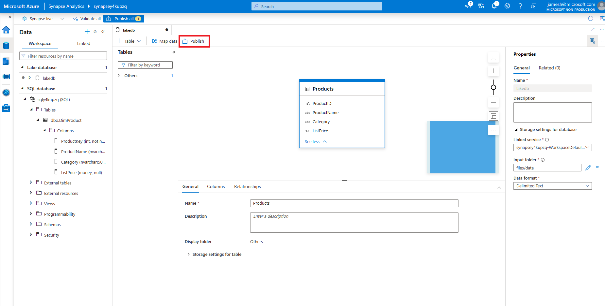
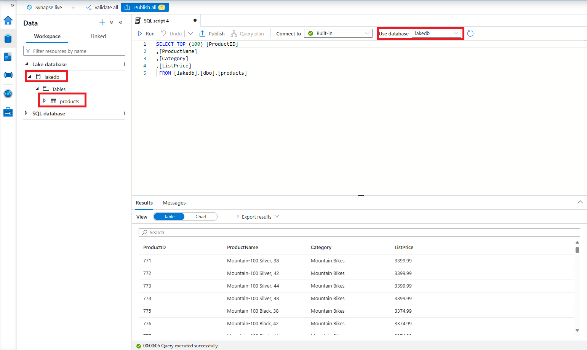
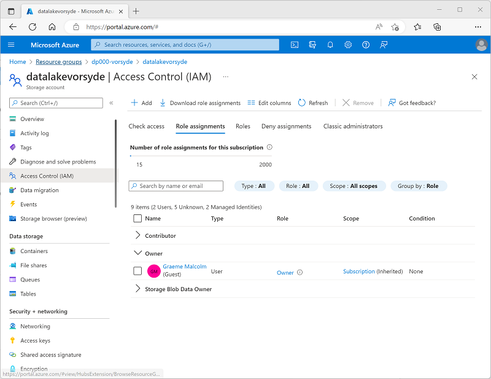
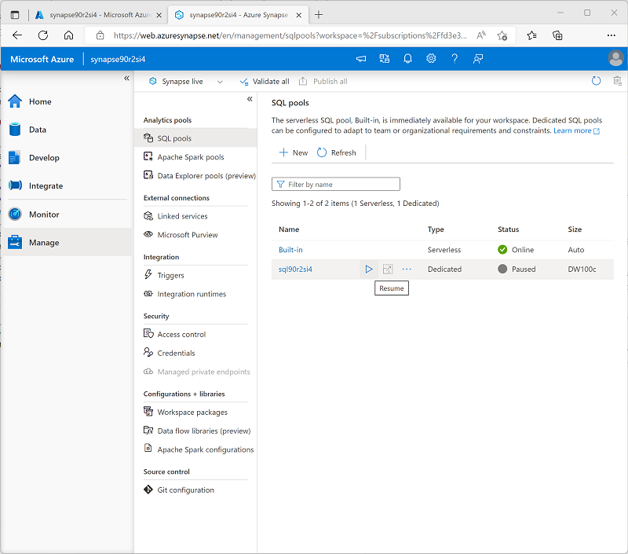
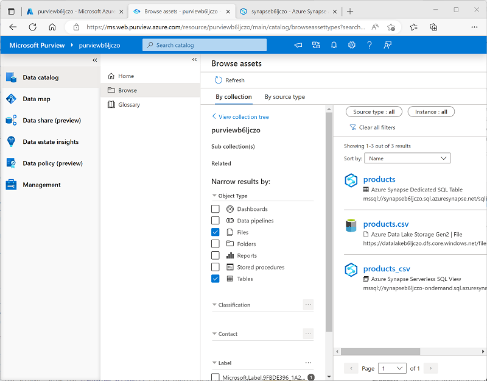

---
lab:
  title: Uso de Microsoft Purview con Azure Synapse Analytics
  ilt-use: Lab
---

> **Importante**: Microsoft Purview se ha actualizado para restringir el número de cuentas de Microsoft Purview disponibles por inquilino de Azure. Por lo tanto, este laboratorio no se admite en entornos de inquilino compartidos, incluidos muchos entornos de laboratorio hospedados que se usan en cursos de aprrendizaje impartidos por un instructor.

# Uso de Microsoft Purview con Azure Synapse Analytics

Microsoft Purview permite catalogar recursos de datos en el patrimonio de datos y realizar un seguimiento del flujo de datos a medida que se transfiere de un origen de datos a otro: un elemento clave de una solución completa de gobierno de datos.

Este ejercicio debería tardar en completarse **40** minutos aproximadamente.

## Antes de comenzar

Necesitarás una [suscripción](https://azure.microsoft.com/free) de Azure en la que tienes privilegios de nivel administrativo y acceso exclusivo al inquilino en el que se define la suscripción.

## Aprovisionamiento de los recursos de Azure

En este ejercicio, usarás Microsoft Purview para realizar un seguimiento de los recursos y el linaje de datos en un área de trabajo de Azure Synapse Analytics. Empezarás con un script para aprovisionar estos recursos en tu suscripción de Azure.

1. Inicie sesión en [Azure Portal](https://portal.azure.com) en `https://portal.azure.com`.
2. Usa el botón **[\>_]** situado a la derecha de la barra de búsqueda en la parte superior de la página para crear una nueva instancia de Cloud Shell en Azure Portal, para lo que deberás seleccionar un entorno de ***Bash*** y crear almacenamiento si se solicita. Cloud Shell proporciona una interfaz de línea de comandos en un panel situado en la parte inferior de Azure Portal, como se muestra a continuación:

    

    > **Nota**: si has creado previamente un Cloud Shell que usa un entorno de *Bash*, usa el menú desplegable situado en la parte superior izquierda del panel de Cloud Shell para cambiarlo a ***PowerShell***.

3. Tenga en cuenta que puede cambiar el tamaño de Cloud Shell arrastrando la barra de separación en la parte superior del panel, o usando los iconos **&#8212;** , **&#9723;** y **X** en la parte superior derecha para minimizar, maximizar y cerrar el panel. Para obtener más información sobre el uso de Azure Cloud Shell, consulte la [documentación de Azure Cloud Shell](https://docs.microsoft.com/azure/cloud-shell/overview).

4. En el panel de PowerShell, escribe los siguientes comandos para clonar este repositorio:

    ```
    rm -r dp-203 -f
    git clone https://github.com/MicrosoftLearning/dp-203-azure-data-engineer dp-203
    ```

5. Una vez clonado el repositorio, escribe los siguientes comandos para cambiar a la carpeta de este laboratorio y ejecuta el script **setup.ps1** que contiene:

    ```
    cd dp-203/Allfiles/labs/22
    ./setup.ps1
    ```

6. Si se le solicita, elige la suscripción que quieres usar (esto solo ocurrirá si tienes acceso a varias suscripciones de Azure).
7. Cuando se te solicite, introduce una contraseña adecuada para tu Azure SQL Database.

    > **Nota**: asegúrate de recordar esta contraseña.

8. Espera a que se complete el script: normalmente tarda unos 15 minutos, pero en algunos casos puede tardar más. Mientras esperas, revisa el artículo [¿Qué está disponible en el portal de gobierno de Microsoft Purview?](https://docs.microsoft.com/azure/purview/overview) en la documentación de Microsoft Purview.

> **Sugerencia**: si después de ejecutar el script de instalación decides no completar el laboratorio, asegúrate de eliminar el grupo de recursos **dp203-*xxxxxxx*** que se creó en la suscripción de Azure para evitar costes innecesarios de Azure.

## Creación de una base de datos de lago

Las bases de datos de lago almacenan datos en un lago de datos en Azure Storage. Los datos se pueden almacenar en formatos Parquet, Delta o CSV y se pueden usar diferentes configuraciones para optimizar el almacenamiento. Cada base de datos de lago usa un servicio vinculado para definir la ubicación de la carpeta de datos raíz.

Las bases de datos de lago son accesibles en el grupo de SQL sin servidor de Synapse y Apache Spark, lo que permite a los usuarios separar el almacenamiento del proceso. Los metadatos asociados a la base de datos de lago facilitan que los distintos motores de proceso no solo proporcionen una experiencia integrada, sino que también usen información adicional (por ejemplo, relaciones) que no se admite originalmente en el lago de datos.

1. Para crear una base de datos de lago, abre primero synapsexxxxxxx desde el grupo de recursos adecuado y haz clic en el vínculo ***abrir*** en **Open Synapse Studio**. 
2. Después, haremos clic en el cuadro de herramientas con la llave en ella, que también es la sección Administrar del área de trabajo de Synapse Analytics y asegurarnos de que el grupo dedicado se está ejecutando. Esto puede tardar unos minutos en iniciarse.
3. A partir de aquí, haremos clic en el símbolo de la base de datos que parece un barril y tiene una etiqueta de datos.
4. Una vez en el panel Datos, haz clic en el símbolo + situado a la derecha de la palabra **Datos** y selecciona ***Base de datos de lago.***
   
    

> **Nota**: recibirás un aviso sobre **los términos de uso de la plantilla de base de datos de Azure Synapse** que debes leer y comprender antes de hacer clic en el botón **Aceptar**.

5. Observarás en el extremo derecho que hay un ventana Propiedades.
   1. En el campo de nombre, escribe **lakedb**
   1. en **Carpeta de entrada**, selecciona la carpeta y ve a root/files/data y presiona **Aceptar**.

>**Nota**: es probable que veas un error al abrir la **carpeta de entrada**, simplemente haz doble clic en la carpeta raíz y baja hasta los datos antes de hacer clic en **Aceptar** si ese es el caso.

   1. A la izquierda de esta pantalla verás un pilar con el nombre **lakedb** con **+Tabla** debajo, haz clic sobre él y selecciona ***Desde lago de datos.***
   1. En el ***Nombre de tabla externo:*** escribe: **Productos**.
   1. En ***Servicio vinculado***, selecciona la opción predeterminada.
   1. En el ***archivo de entrada o carpeta***, haz clic en la carpeta del archivo situada en el extremo derecho y ve a **raíz > archivos > datos >** y selecciona ***products.csv*** y haz clic en **Aceptar** y después haz clic en **Continuar**.

6. En el panel **Nueva tabla externa**, selecciona la opción Primera fila para ***deducir nombres de columna*** y haz clic en **Crear**.


7. Presione **Publicar** en la parte superior de la ventana de diseño de la consulta.
8. En **Datos** asegúrate de que estás en el área **Área de trabajo** en la parte izquierda y expande la sección **Base de datos de lago**, expande **lakedb**, luego ***mantén el mouse sobre*** la parte derecha de la tabla **Productos** y elige las ***primeras 100 filas***.



> **Nota**: Debes asegurarte de que la opción **Conexión a** aparece como **Integrada** y puedes dejar seleccionada la base de datos **maestra** o haz clic en el botón de actualización de la derecha y selecciona la base de datos **lakedb**. Dado que usa la convención de nomenclatura de 3 partes [base de datos].[esquema].[tabla], ambas acciones funcionarán.



9. Presiona el botón **Ejecutar** para ver los datos dentro de la tabla de base de datos de lago.

## Agregar el servicio Microsoft Purview a la cuenta

Microsoft Purview es una cartera completa de productos que abarcan la gobernanza de datos, la protección de información, la administración de riesgos y las soluciones de cumplimiento. Te ayuda a gobernar, proteger y administrar todo el estado de los datos en el entorno local, multinube y de software como servicio (SaaS).

Para configurarlo, primero volveremos a nuestro grupo de recursos principal, que se denominará dp203-xxxxxxx en función del número aleatorio que se te haya asignado. Una vez que estés dentro del **grupo de recursos**, haz clic en el botón ***+ Crear*** para agregar un nuevo servicio.

1. Selecciona el **servicio Microsoft Purview** y haz clic en el botón **Crear**.
2. Durante el proceso de creación, dado que iniciaste en el grupo de recursos adecuado, ya debería estar seleccionado. Después, le asignaremos un nombre a **Purview** con el número asignado aleatoriamente. Luego, selecciona la mejor región para la instancia.

   

3. Haz clic en el botón **Revisar y crear** y espera a la ***Validación*** antes de seguir adelante.

   

4. Una vez superada la validación, pulsa el botón **Crear**.

> **Nota**: Es posible que tengas que probar con varias regiones para poder superar la validación con Purview.

## Catalogación de recursos de datos de Azure Synapse Analytics en Microsoft Purview

Con Microsoft Purview, puedes catalogar recursos de datos en todo el patrimonio de datos, incluso los orígenes de datos en un área de trabajo de Azure Synapse. El área de trabajo que acabas de implementar incluye un lago de datos (en una cuenta de Azure Data Lake Storage Gen2), una base de datos sin servidor y un almacenamiento de datos en un grupo de SQL dedicado.

### Configurar el acceso basado en roles para Microsoft Purview

Microsoft Purview está configurado para usar una identidad administrada. Para catalogar recursos de datos, esta cuenta de identidad administrada debe tener acceso al área de trabajo de Azure Synapse Analytics y a la cuenta de almacenamiento de su almacenamiento de datos de lago.

1. En [Azure Portal](https://portal.azure.com), ve al grupo de recursos **dp203-*xxxxxxx*** creado por el script de instalación y consulta los recursos que se crearon. Entre ellas se incluyen las siguientes:
    - Una cuenta de almacenamiento con un nombre similar a **datalake*xxxxxxx***.
    - Una cuenta de Microsoft Purview con un nombre similar a **purview*xxxxxxx***.
    - Un grupo de SQL dedicado con un nombre similar a **sql*xxxxxxx***.
    - Un área de trabajo de Synapse con un nombre similar a **synapse*xxxxxxx***.
2. Abre la cuenta de almacenamiento **datalake*xxxxxxx*** y, en su página **Control de acceso (IAM)**, consulta la pestaña **Asignaciones de roles**; como se muestra aquí:

    

3. En el menú del botón **+ Agregar**, selecciona **Agregar asignación de roles**. 
4. En la página **Agregar asignación de roles**, en la pestaña **Roles**, busca "blob de almacenamiento" y selecciona el rol **Lector de datos de Blob Storage**. Selecciona **Siguiente** para ir a la pestaña **Miembros**:

    

5. En la pestaña **Miembros**, en la lista **Asignar acceso a**, selecciona **Identidad administrada** y luego, en **Miembros**, selecciona **Seleccionar miembros**.
6. En el panel **Seleccionar identidades administradas**, en la lista **Identidades administradas**, selecciona **Cuenta de Microsoft Purview (*n*)** y selecciona tu cuenta de Microsoft Purview, que debe tener un nombre similar a **purview*xxxxxxx***. Usa el botón **Seleccionar** para agregar esta cuenta a la asignación de roles:

    

7. Usa el botón **Revisar y asignar** para completar la asignación de roles, que convierte la cuenta **purview*xxxxxxx*** utilizada por la identidad administrada para tu recurso Microsoft Purview en miembro del rol **Lector de datos de Storage Blob** para tu cuenta de almacenamiento.
8. En Azure Portal, vuelve al grupo de recursos **dp203-*xxxxxxx*** y abre el área de trabajo **synapse*xxxxxxx*** Synapse Analytics. Después, en su página **Control de acceso (IAM)**, agrega una asignación de roles para que la cuenta de identidad administrada **purview*xxxxxxx*** sea miembro del rol **Lector** en el área de trabajo.

### Configurar los permisos de base la de datos para Microsoft Purview

Tu área de trabajo de Azure Synapse Analytics incluye bases de datos tanto en los grupos *sin servidor* como *dedicados* de SQL, a los que la identidad administrada que usa Microsoft Purview requiere acceso.

1. En Azure Portal, en la página de tu área de trabajo de Synapse Analytics, consulta la pestaña **Información general**. Después, en el icono **Abrir Synapse Studio**, usa el vínculo para abrir Azure Synapse Studio en una nueva pestaña del explorador e inicia sesión si se te solicita.

    >**Sugerencia**: como alternativa, puedes abrir Azure Synapse Studio si navegas directamente a https://web.azuresynapse.net en una nueva pestaña del explorador.

2. En el lado izquierdo de Synapse Studio, usa el icono **&rsaquo;&rsaquo;** para expandir el menú, lo que mostrará las diferentes páginas de Synapse Studio.
3. En la página **Administrar**, en la pestaña **Grupos de SQL**, selecciona la fila del grupo de SQL dedicado **sql*xxxxxxx*** y usa su icono **▷** para iniciarlo; confirma que deseas reanudarlo cuando se te pida hacerlo.

    

4. Espera a que se reanude el grupo de SQL. Esta operación puede tardar unos minutos. Puedes usar el botón **↻ Actualizar** para comprobar su estado periódicamente. El estado se mostrará como **En línea** cuando esté listo.
5. En Azure Synapse Studio, visualiza la página **Datos** y en la pestaña **Área de trabajo**, expande **Base de datos SQL** para ver las bases de datos del área de trabajo. Deberían incluir lo siguiente:
    - Una base de datos del grupo de SQL sin servidor denominada **lakedb**.
    - Una base de datos del grupo de SQL dedicado denominada **sql*xxxxxxx***.

    

6. Selecciona la base de datos **lakedb** y después en el menú ** ...**, selecciona **Nuevo script SQL**** > SQL vacío** para abrir un nuevo panel **Script  de SQL 1.** Puedes usar el botón **Propiedades** (que tiene un aspecto similar a **<sub>*</sub>**) en el extremo derecho de la barra de herramientas para ocultar el panel **Propiedades** y ver el panel de scripts más fácilmente.
7. En el panel **Script de SQL1**, escribe el siguiente código SQL y reemplaza todas las instancias de ***purviewxxxxxxx*** por el nombre de identidad administrada de la cuenta de Microsoft Purview:

    ```sql
    CREATE LOGIN purviewxxxxxxx FROM EXTERNAL PROVIDER;
    GO

    CREATE USER purviewxxxxxxx FOR LOGIN purviewxxxxxxx;
    GO

    ALTER ROLE db_datareader ADD MEMBER purviewxxxxxxx;
    GO
    ```

8. Usa el botón **▷ Ejecutar** para ejecutar el script, que crea un inicio de sesión en el grupo sin servidor y un usuario del usuario **lakedb** para la identidad administrada usada por Microsoft Purview y agrega el usuario al rol **db_datareader** en la base de datos **lakedb**.
9. Crea un nuevo script vacío para la base de datos del grupo de SQL dedicado **sql*xxxxxxx*** y úsalo para ejecutar el siguiente código SQL (reemplazando ***purviewxxxxxxx*** por el nombre de identidad administrada de la cuenta de Microsoft Purview). Esto crea un usuario en el grupo de SQL dedicado para la identidad administrada usada por Microsoft Purview y lo agrega al rol **db_datareader** en la base de datos **sql*xxxxxxx***.

    ```sql
    CREATE USER purviewxxxxxxx FROM EXTERNAL PROVIDER;
    GO

    EXEC sp_addrolemember 'db_datareader', purviewxxxxxxx;
    GO
    ```

### Registro de orígenes en el catálogo de Microsoft Purview

Ahora que has configurado el acceso necesario para que Microsoft Purview examine los orígenes de datos que el área de trabajo de Azure Synapse Analytics usa, puedes registrarlos en el catálogo de Microsoft Purview.

1. Vuelve a la pestaña del explorador que contiene Azure Portal y visualiza la página del grupo de recursos **dp203-*xxxxxxx***.
2. Abre la cuenta de Microsoft Purview **purview*xxxxxxx*** y en su página **Información general**, usa el vínculo para abrir el **Portal de gobernanza de Microsoft Purview** en una nueva pestaña del explorador: inicia sesión si se solicita.

    >**Sugerencia**: como alternativa, puedes ir directamente a https://web.purview.azure.com en una nueva pestaña del explorador.

3. En el lado izquierdo del Portal de gobernanza de Azure Purview, usa el icono **&rsaquo;&rsaquo;** para expandir el menú; esto muestra las distintas páginas del portal.
4. En la página **Mapa de datos**, en la página **Orígenes**, selecciona **Registrar**:

    

5. En la pestaña **Registrar orígenes** que aparece, selecciona **Azure Synapse Analytics** y continúa registrando un origen con la siguiente configuración:
    - **Nombre**: Synapse_data
    - **Suscripción de Azure**: *selecciona tu suscripción de Azure*
    - **Nombre del área de trabajo**: *selecciona el área de trabajo **synapsexxxxxxx.***
    - **Punto de conexión SQL dedicado**: sql*xxxxxxx*.sql.azuresynapse.net
    - **Punto de conexión de SQL sin servidor**: sql*xxxxxxx*-ondemand.sql.azuresynapse.net
    - **Seleccionar una colección**: Root (purview*xxxxxxx*)

    Este origen de datos incluye las bases de datos SQL en el área de trabajo de Azure Synapse Analytics.

6. Después de registrar el origen **Synapse_data**, selecciona **Registrar** de nuevo y registra un segundo origen para el almacenamiento del lago de datos que el área de trabajo de Azure Synapse ha usado. Selecciona **Azure Data Lake Storage Gen2** y especifica la siguiente configuración:
    - **Nombre**: Data_lake
    - **Suscripción de Azure**: *selecciona tu suscripción de Azure*
    - **Nombre del área de trabajo**: *selecciona la cuenta de almacenamiento **datalakexxxxxxx**.*
    - **Punto de conexión**: https:/ /datalakexxxxxxx.dfs.core.windows.net/
    - **Seleccionar una colección**: Root (purview*xxxxxxx*)
    - **Administración del uso de datos**: deshabilitado

    Después de registrar los orígenes **Synapse_data** y **Data_lake**, ambos deben mostrarse en la colección raíz **purview*xxxxxxx*** en el mapa de datos, como se muestra aquí:

    

### Examen de orígenes registrados

1. En el mapa de datos, en el origen **Synapse_data**, selecciona **Ver detalles** y observa que el origen no tiene recursos catalogados. Deberás examinar el origen para encontrar los recursos de datos que contiene.
2. En la página de detalles de **Synapse_data**, selecciona **Nuevo examen** y, a continuación, configura un examen con la configuración siguiente:
    - **Nombre**: Scan-Synapse
    - **Conectar al entorno de ejecución de integración**: Azure AutoresolveIntegrationRuntime
    - **Tipo**: SQL Database
    - **Credencial**: Microsoft Purview MSI (system)
    - **SQL Database**: *selecciona <u>tanto</u> la base de datos dedicada **sqlxxxxxxx** como la base de datos sin servidor **lakedb**.*
    - **Seleccionar una colección**: Root (purview*xxxxxxx*)

    

3. Continúa con la página **Seleccionar un conjunto de reglas de examen**, en la que se debe seleccionar el conjunto de reglas de ** AzureSynapseSQL** predeterminado.
4. Continúa con la página **Establecer un desencadenador de examen** y selecciona  **Una vez** para ejecutar el examen una vez.
4. Continúa con la página **Revisar el examen** y después guarda y ejecuta el examen.
6. Mientras se ejecuta el examen de **Synapse_data**, vuelve a la página **Orígenes** para ver el mapa de datos y en el origen **Data_lake**, usa el icono **Nuevo examen** para iniciar un examen del lago de datos con la siguiente configuración:
    - **Nombre**: Scan-Data-Lake
    - **Conectar al entorno de ejecución de integración**: Azure AutoresolveIntegrationRuntime
    - **Credencial**: Microsoft Purview MSI (system)
    - **Seleccionar una colección**: Root (purview*xxxxxxx*)
    - **Ámbito del examen**: *selecciona **Data_lake** y todos los subrecursos.* 
    - **Seleccionar un conjunto de reglas de examen**: AdlsGen2
    - **Establecer un desencadenador de examen**: una vez
    - **Revisar el examen** guarda y ejecuta
7. Espera hasta que ambos exámenes se completen: esto puede tardar varios minutos. Puedes ver la página de detalles de cada uno de los orígenes para ver el **Estado de la última ejecución**, tal como se muestra a continuación (puedes usar el botón **↻ Actualizar** para actualizar el estado). También puedes ver la página **Supervisión** aunque los exámenes pueden tardar algún tiempo en aparecer allí:

    

### Visualización de los recursos examinados

1. En la página **Catálogo de datos**, en la subpágina **Examinar**, selecciona la colección **purview*xxxxxxx***. Aquí puedes ver los recursos de datos que se catalogaron en el área de trabajo de Azure Synapse y en Data Lake Storage, incluida el área de trabajo de Azure Synapse Analytics, la cuenta de Azure Storage para el lago de datos, las dos bases de datos del grupo de SQL en Azure Synapse Analytics, el esquema **dbo** en cada base de datos, las tablas y vistas de las bases de datos, y las carpetas y los archivos del lago de datos.
2. Para filtrar los resultados, en la lista de tipos de objetos **Restringir los resultados por**, selecciona **Archivos** y **tablas** para que solo se muestren los archivos, tablas y vistas que el examen catalogó:

    

    Observa que los recursos de datos incluyen:

    - **products**: una tabla del grupo de SQL dedicado para los datos del producto.
    - **products.csv**: un archivo en el lago de datos.
    - **products_csv**: una vista del grupo de SQL sin servidor que lee los datos del producto del archivo *products.csv*.

3. Para explorar los recursos que se encontraron, selecciónalos y consulta sus propiedades y esquema. Puede editar las propiedades de los recursos (incluidos campos individuales) para agregar metadatos, categorizaciones, detalles de contacto para expertos en la materia y otros detalles útiles para que los analistas de datos puedan encontrar una gran cantidad de información sobre los recursos de datos de su patrimonio de datos explorando en el catálogo de datos de Microsoft Purview.

Hasta ahora, has usado Microsoft Purview para catalogar recursos de datos en el área de trabajo de Azure Synapse Analytics. Puedes registrar varios tipos de origen de datos en un catálogo de Microsoft Purview, lo que te permite crear una vista centralizada y consolidada de los recursos de datos.

Ahora vamos a explorar otras formas de integrar Azure Synapse Analytics y Microsoft Purview.

## Integración de Microsoft Purview con Azure Synapse Analytics

Azure Synapse Analytics admite la integración con Microsoft Purview para que los recursos de datos se puedan detectar y para que se pueda realizar un seguimiento del linaje de datos a través de canalizaciones de ingesta que transfieren datos de un origen a otro.

### Habilitar la integración de Microsoft Purview en Azure Synapse Analytics

1. Vuelve a la pestaña del explorador que contiene Synapse Studio y en la página **Administrar**, selecciona la pestaña **Microsoft Purview** y después usa el botón **Conectarse a una cuenta de Purview** para conectar la cuenta **purview*xxxxxxx*** de la suscripción al área de trabajo.
2. Después de conectar la cuenta, visualiza la pestaña **Cuenta de Purview** para comprobar que la cuenta tiene un estado **Linaje de datos: canalización de Synapse** de **Conectado**:

    

### Búsquedas en el catálogo de Purview en Synapse Studio

Ahora que has conectado la cuenta de Microsoft Purview al área de trabajo de Azure Synapse Analytics, puede buscar en el catálogo de Synapse Studio, lo que te permite detectar recursos de datos en el patrimonio de datos.

1. En Synapse Studio, visualiza la página **Integrar**.
2. En la parte superior de la página, usa el cuadro **Buscar** para buscar el origen de **Purview** para el término "products", como se muestra aquí:

    

3. En los resultados, selecciona **products.csv** para ver sus detalles en el catálogo de Purview.

Al integrar el catálogo de Purview en la interfaz de Synapse Studio, los analistas de datos y los ingenieros pueden encontrar y examinar los recursos de datos registrados de todo el patrimonio de datos (no solo dentro del área de trabajo de Azure Synapse Studio).

### Creación y ejecución de una canalización

La vista de **products_csv** de la base de datos **lakedb** se basa en un archivo de texto del lago de datos que contiene datos del producto. La tabla **products** de la base de datos SQL dedicada **sql*xxxxxxx*** está vacía actualmente. Vamos a usar una canalización de Synapse para cargar datos del lago de datos en la tabla.

1. En Synapse Studio, en la página **Integrar**, en el menú ****+, selecciona la herramienta **Copiar datos**.
2. En la herramienta Copiar datos, selecciona **Tarea de copia integrada** y **Ejecutar una vez ahora**, y después selecciona **Siguiente**.
3. En la página **Almacén de datos de origen**, en la lista **Conexión**, selecciona la conexión **synapse*xxxxxxx* - WorkspaceDefaultStorage** (que hace referencia al lago de datos del área de trabajo) y para el **archivo o carpeta**, busca el archivo **files/products/products.csv**. Seleccione **Siguiente**.
4. En la página **Configuración del formato de archivo**, selecciona **Detectar formato de texto**. Después, asegúrate de que se especifican las siguientes opciones antes de seleccionar **Siguiente**:
    - **Formato de archivo**: DelimitedText
    - **Delimitador de columna**: coma (,)
    - **Delimitador de fila**: avance de línea (\n)
    - **Primera fila como encabezado**: seleccionada
    - **Tipo de compresión**: ninguno
5. En la página **Almacenamiento de datos de destino**, en la lista **Conexión**, selecciona **sql*xxxxxxx*** (la conexión a tu grupo de SQL dedicado). Después, establece el destino en la tabla **dbo.productos** existente y selecciona **Siguiente**.
6. En la página **Asignación de columnas**, revisa las asignaciones de columnas predeterminadas y selecciona **Siguiente**.
7. En la página **Configuración**, establece la opción **Nombre de la tarea** en **Load_Product_Data**. Después, selecciona el método de copia **Inserción masiva** y selecciona **Siguiente**.
8. En la página **Resumen**, seleccione **Siguiente**.
9. Espera a que se implemente la canalización y selecciona **Finalizar**.
10. En Synapse Studio, consulta la página **Supervisar**. Después, en la pestaña **Ejecuciones de canalización**, observa el estado de la canalización **Load_Product_Data**. El estado puede tardar unos minutos en cambiar a **Correcto**.
11. Cuando la ejecución de la canalización se haya completado correctamente, selecciona su nombre (**Load_Product_Data**) para ver los detalles de las actividades de la canalización y observa que la canalización incluye una tarea **Copiar datos** con un nombre derivado automáticamente similar a **Copy_* xxx***. Esta actividad copió los datos del archivo de texto del lago de datos en la tabla **products** de la base de datos **sql*xxxxxxx***.

### Ver el linaje de datos en Microsoft Purview

Usaste una canalización de Synapse para cargar datos en una base de datos. Vamos a comprobar que se ha realizado un seguimiento de esta actividad en Microsoft Purview.

1. Cambia a la pestaña del explorador que contiene el portal de gobernanza de Microsoft Purview.
2. En la página **Catálogo de datos**, en la subpágina **Examinar**, selecciona la colección **purview*xxxxxxx***.
3. Filtra los recursos para mostrar solo **Canalizaciones de datos**, **Archivos** y **Tablas**. La lista de recursos debe incluir el archivo **products.csv**, la actividad de canalización **Copy_*xxx*** y la tabla **products**.
4. Selecciona el recurso **Copy_*xxx*** para ver sus detalles y observa que la opción **Hora de actualización** refleja la ejecución reciente de la canalización.
5. En la pestaña **Linaje** del recurso **Copy_*xxx***, consulta el diagrama que muestra el flujo de datos desde el archivo **products.csv** hasta la tabla **products**:

    

6. En el diagrama de linaje **Copy_*xxx***, selecciona el archivo **products.csv** y usa su vínculo **Cambiar al recurso** para ver los detalles del archivo de origen.
7. En el diagrama de linaje **products.csv**, selecciona la tabla **products** y usa su vínculo **Cambiar al recurso** para ver los detalles de la tabla (es posible que tengas que usar el botón **↻ Actualizar** para ver el diagrama de linaje de la tabla).

La funcionalidad de seguimiento del linaje que se habilita al integrar Azure Synapse Analytics con Microsoft Purview te permite determinar cómo y cuándo se cargaron los datos en tus almacenamientos de datos y de dónde proceden.

> **Sugerencia**: en este ejercicio, visualizaste la información de linaje para en el portal de gobernanza de Microsoft Purview, pero recuerda que los mismos recursos también se pueden ver en Synapse Studio a través de la característica de integración de búsqueda.

### Pausar el grupo de SQL dedicado

1. Vuelve a la pestaña de Synapse Studio y, en la página **Administrar**, pausa el grupo de SQL dedicado **sql*xxxxxxx***.

## Eliminación de recursos de Azure

Si ha terminado de explorar Azure Synapse Analytics, debe eliminar los recursos que ha creado para evitar costos innecesarios de Azure.

1. Cierre la pestaña del explorador de Synapse Studio y vuelva a Azure Portal.
2. En Azure Portal, en la página **Inicio**, seleccione **Grupos de recursos**.
3. Selecciona el grupo de recursos **dp203-*xxxxxxx*** para tu área de trabajo de Synapse Analytics (no el grupo de recursos administrados) y verifica que contiene el área de trabajo de Synapse, la cuenta de almacenamiento y el grupo de SQL dedicado para tu área de trabajo.
4. En la parte superior de la página **Información general** del grupo de recursos, seleccione **Eliminar grupo de recursos**.
5. Especifica el nombre del grupo de recursos **dp203-*xxxxxxx*** para confirmar que quieres eliminarlo y selecciona **Eliminar**.

    Después de unos minutos, se eliminarán el grupo de recursos de área de trabajo de Azure Synapse y el grupo de recursos de área de trabajo administrado asociado a él.
